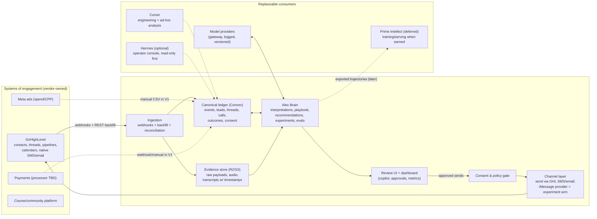

# AgencyOS Architecture Review — 2026-08-08

**Status:** Review artifact. Supersedes-in-part `docs/architecture/agencyos-architecture.md` (see §11).
**Author:** Architecture review pass requested by Kamal (full transcript coverage + repo inspection + vendor verification).
**Decision requested:** Adopt the V1 scope in §9 and the roadmap in §10; amend ADRs as listed in §11.
**Nothing in this document has been implemented.** All file paths marked *(proposed)* do not exist yet.

---

## How to read this document

This review answers one question:

> Given what Alex and Kamal are actually trying to accomplish, what should AgencyOS really become, and what is the correct technical path from the system we have today to that product?

It is written to be self-contained: an agent or engineer with no access to the originating conversation should be able to understand, critique, and implement against it. Section 0 establishes the evidence base. Sections 1–12 are the review itself. Section 13 is an adversarial review of this document's own recommendations, with the revisions it forced.

---

## 0. Evidence base and method

### 0.1 Sources read in full

| Source | What it is | Weight |
|---|---|---|
| `docs/founder-context/transcripts/alex-call-01.txt` + `.segments.txt` (87 timestamped segments, ~7.7 min) | Raw Whisper transcript of Alex's mission-brief call, 2026-08-04 | **Primary founder evidence** |
| `docs/founder-context/transcripts/alex-call-02.txt` + `.segments.txt` (107 timestamped segments, ~12.8 min) | Raw Whisper transcript of Alex's GHL/community/lead-AI call, 2026-08-04 | **Primary founder evidence** |
| `docs/founder-context/alex-call-01.md`, `alex-call-02.md` | Curated summaries of the calls | Secondary (checked against raw transcripts; consistent) |
| `docs/founder-context/agencyos-current-strategy.md` | The existing strategy | **Hypothesis under review, not a requirement** |
| `docs/founder-context/founder-intent.md` | Distilled intent doc | Secondary |
| `docs/architecture/agencyos-architecture.md` | Draft v0 architecture | Hypothesis under review |
| `docs/decisions/ADR-001` … `ADR-007` | Locked decisions dated 2026-08-08 | Reviewed individually in §2 |

Transcript citations below use the form `[call-02 0587–0597]`, meaning the timestamped segment range in `docs/founder-context/transcripts/alex-call-02.segments.txt`.

### 0.2 What the repository actually contains (source of truth for "what exists")

**The repository contains documentation only.** As of 2026-08-08:

- No application code. No `package.json`, no `convex/` directory, no Convex schema, no integrations, no tests, no CI.
- Git has **zero commits**; everything is untracked.
- Contents: the founder-context docs, transcripts and audio, one draft architecture doc, seven ADRs, and a `.gitignore`.

This matters. Any strategy language implying a partially built system is wrong. The real assets are **outside the repo**:

| Asset | Where it lives | Status |
|---|---|---|
| ~5–6k leads with tags, DM/SMS threads, qualification fields | SSA's GoHighLevel agency account | Exists; un-audited; buckets unclear `[call-01 0366–0387]` |
| ~200 sales-call recordings/transcripts | Location stated as "recorded with transcripts"; exact storage (GHL calls vs. external recorder) **unverified** `[call-02 0614–0623]` | Exists; not yet ingested anywhere we control |
| $97 VSL funnel (IG ads → Vidalytics VSL → checkout), CPP $70–140 | Live funnel | Operating `[call-01 0038–0111]` |
| Course + community ("school group", presumably Skool — unverified) | Third-party platform | Operating `[call-01 0190–0204]` |
| 40+ testimonials, Alex's cash reserves, consulting capacity | Business | Stated `[call-02 0265–0301]` |
| Alex's local "Agent OS" environment (Mac Mini, third-party dashboard, Hermes runtime, Obsidian vault) | Alex's hardware | Exists per an unverified 2026-08-03 snapshot; **different business context; most dashboard surfaces non-operational at capture; not treated as SSA infrastructure in this review** |

### 0.3 Third-party capabilities verified against first-party documentation (as of 2026-08-08)

These claims materially affect the architecture and were checked against current vendor documentation rather than model memory:

| Claim | Verified state | Source class |
|---|---|---|
| GHL API v2 can export conversations and messages | Yes. Conversation search, get-messages-by-conversation, get-message, and message-export endpoints exist on `services.leadconnectorhq.com` | GHL API v2 docs (`marketplace.gohighlevel.com/docs`, `GoHighLevel/highlevel-api-docs`) |
| GHL API can return call recordings and call transcriptions | Yes, via dedicated endpoints: `GET /conversations/messages/{messageId}/locations/{locationId}/recording` and `…/transcription` (plus a download-transcription endpoint). The `attachments` field on normal message endpoints is intentionally empty for calls | GHL API docs + maintainer response on `highlevel-api-docs` issue #258 |
| GHL webhook events cover the lifecycle | Yes: `ContactCreate/Update`, `InboundMessage`, `OutboundMessage`, `OpportunityCreate/StageUpdate/StatusUpdate`, `AppointmentCreate/Update/Delete`, `InvoicePaid`, `OrderStatusUpdate`, etc. Delivered to marketplace apps (OAuth) and via location/workflow webhook actions | GHL webhook docs |
| GHL ships an official MCP server | Yes: `https://services.leadconnectorhq.com/mcp/`, authenticated with a Private Integration Token + locationId; on the order of 21–36 tools (contacts, conversations, calendars, opportunities, payments); roadmap claims expansion. **Does not currently expose call transcription/recording tools** (open feature request). GHL Workflow AI Agents can also *consume* external MCP servers (July 2026 feature) | GHL support portal + ideas board |
| Automated outbound iMessage is possible | Only via unofficial third-party bridges (e.g., Sendblue, LoopMessage) running real Apple hardware. No official Apple API exists; Apple Messages for Business is customer-initiated only. Vendors mitigate but cannot eliminate account-flagging risk. TCPA consent/opt-out rules fully apply. Sendblue advertises SOC 2 Type II, HIPAA support, and a **native GoHighLevel integration** | Sendblue/LoopMessage docs and comparison material |
| Convex provides what a small team needs for a system of record + pipelines | Yes: document DB with schema validation, transactional mutations, scheduled functions and crons stored durably in the DB, full-text + vector search, file storage, HTTP actions (webhook receivers), Agent component (threads/messages), Workflow/Workpool components for durable multi-step jobs | `docs.convex.dev` |
| Hermes is a production-suitable system of record | No. `NousResearch/hermes-agent` is an MIT-licensed, fast-moving **personal/ops agent runtime** (Python; ~monthly releases with large internal refactors; messaging gateways for Telegram/Discord/Slack/WhatsApp/Signal; skills + agent-curated memory; cron; subagents; MCP catalog). Excellent operator console; wrong place to store canonical business data or evaluation state | `NousResearch/hermes-agent` repo/releases |
| Prime Intellect offers training/serving relevant to a future "Alex model" | Yes, later: `prime-rl` (SFT + large-scale RL), verifiers/Environments Hub (2,500+ environments), hosted training, inference with LoRA serving. `Prime Agent` specifically is an open-source **coding/research** agent (RLM + Continual Harness) — a dev tool, not a sales-automation runtime | `primeintellect.ai`, `PrimeIntellect-ai/prime-rl`, `PrimeIntellect-ai/prime-agent` |

Unverified items that remain open questions are listed in §12 (e.g., whether legacy ManyChat/IG threads are fully represented in GHL conversations, where the 200 recordings physically live, which community platform is in use, and what the payment processor of record is).

---

## 1. Founder Intent

### 1.1 What Alex and Kamal are actually trying to build

Four distinct goals are in the transcripts, in Alex's own words:

1. **Fix front-end unit economics before scaling ads.** CPP is $70–140 against a $97 offer; an AOV upsell ("a tool… a feature… something that helps the new students get customers, make money faster") is the unlock for more ad spend `[call-01 0101–0150]`.
2. **Replace the expensive-confusion ladder with cheaper competence.** Inner Circle was $5–7k, DFY $25k; "it doesn't feel good selling something so expensive… they don't know what they're doing." Lower price, raise delivered value, mitigate risk — enabled by agent tooling `[call-01 0151–0190]`.
3. **Create enterprise value that survives ads being turned off.** "If we spend a ton of money on the ads and we make a shit ton of money, but when we turn the ads off, we have nothing… how can we create something that they all use and become users… that we can end up selling one day" `[call-01 0222–0258]`. Plus opt-in recurring community at $100–200/mo instead of hard upsells `[call-02 0030–0083]`.
4. **An AI that works the lead base like Alex, and eventually helps run the business.** Scan every conversation; score leads; learn why closed deals closed; find gaps in lost threads; build ICP from closed buyers; detect drop-off phrases and winning word-for-word patterns; run a hypothesis → send → score → optimize loop; nurture over iMessage with Alex's voice, life knowledge, and human cadence; mine the 200 call transcripts for pains; long-term, an agent with a spend card that audits the business and proposes ad/community/content moves `[call-02 0303–0768]`.

The partnership shape is explicit: Kamal brings organization, patience, and technical execution; Alex brings sales, marketing, speed, cash, the lead archive, and testimonials `[call-01 0329–0365]`, `[call-02 0265–0301]`. Manny is in the operating core with a role to be defined `[call-02 0232–0259]`. Mission framing (money, helping people, faith, learning AI) is real to Alex and should shape tone policy, not architecture `[call-01 0416–0434]`.

### 1.2 The four-way question: language, procedure, decisions, or outcomes?

The prompt asks whether the real objective is (1) copying Alex's language, (2) copying his sales procedures, (3) learning his decision-making, or (4) optimizing decisions against measured outcomes. The transcripts contain all four, at different levels of maturity:

| Objective | Direct evidence | Role in the system |
|---|---|---|
| 1. Language imitation | "replicate it only from the ones that actually have the closed status" `[call-02 0342–0349]`; "patterns specific word for word messages on what worked" `[call-02 0410–0422]`; "I want the AI chat bot to be me, to be me with my knowledge base" `[call-02 0587–0597]` | **Bootstrap prior + brand constraint.** Necessary for trust; not defensible IP by itself |
| 2. Procedure imitation | Cadence: "text back and forth for a couple hours… leave them on read for like a day and a half… then continue"; auto-follow-up; send video/PDF then ask what they thought `[call-02 0568–0597, 0677–0686]` | **Explicit policy, encoded as rules** — not learned weights. Cheap to implement, easy to audit |
| 3. Decision imitation | "the AI needs to see the way we talk to the client and understand **why** we do that" `[call-02 0335–0349]`; long-term: "rely on the AI to come up with decisions on whether to scale the ads… scale the school group, create specific types of content" `[call-02 0749–0765]` | **Intermediate stage.** Its real function is generating labeled decision data (shadow mode, §7) |
| 4. Outcome optimization | "we send the message. And then if we get a reply, we score it… comes up with a hypothesis… starts that experiment, tracks that data and continuously optimizes" `[call-02 0432–0477]`; A/B direct CTA vs relationship nurture `[call-02 0516–0568]` | **The actual objective.** Alex himself specifies an experiment loop, not a parrot |

**Conclusion: the objective is (4), outcome optimization, with (1) and (2) as the bootstrap prior and standing brand/behavior constraints, and (3) as the intermediate stage whose purpose is to accumulate paired (context, Alex-action, AI-recommendation, outcome) records.** The compounding, sellable asset is not a model that talks like Alex — any frontier model with a style corpus can do that within weeks. The compounding asset is the **proprietary evidence ledger**: the only dataset in the world that records how this specific business's leads respond to specific actions, joined to revenue outcomes, plus the evaluation infrastructure that turns that ledger into better decisions. Models are interchangeable consumers of that asset (§3.9).

### 1.3 Implied requirements Alex never stated explicitly

1. **An owned, durable data foundation.** "The AI scans and becomes smarter and smarter" `[call-02 0438–0451]` presumes the learning accumulates somewhere. Today it would accumulate nowhere: GHL holds raw threads but no interpretations, outcomes joins, or experiment history. Enterprise value ("something we can sell one day") requires this asset to exist outside any single vendor or model.
2. **Reliable outcome labels before any learning.** "Learn only from closed" requires that closed/lost status is trustworthy across 5–6k historical leads. Alex himself says buckets are unclear `[call-01 0366–0387]`. Data hygiene precedes intelligence.
3. **Consent and messaging compliance.** Never mentioned in either call. Automated texting of thousands of aged leads is squarely TCPA territory (prior express consent, immediate opt-out honoring, quiet hours). This is the largest unpriced risk in the vision and gets a first-class component (§3.8, §12).
4. **Human review before the AI speaks as Alex.** "The bot should be me" cuts both ways: every mistake is attributed to Alex personally, in a business whose new strategy is trust (ADR-002). Autonomy must be earned through shadow mode (§7), not granted.
5. **Statistical honesty.** Alex's "more tags = more likely to buy" `[call-02 0646–0661]` and "see the drop-offs based off of what we said" `[call-02 0397–0410]` are correlational claims. The system must treat mined patterns as hypotheses to test, or it will confidently optimize noise (§4.4).

---

## 2. Strategy Delta

Verdicts on every significant idea in `agencyos-current-strategy.md`, `agencyos-architecture.md`, and ADRs 001–007. "The strategy" below refers to those documents collectively.

### KEEP

| Idea | Why it stands |
|---|---|
| **AOV before ad scale** (ADR-004, strategy pillar 1) | Pure unit-economics logic, directly from `[call-01 0119–0150]`. No architectural objection. Note: most AOV work (VSL/checkout redesign, upsell asset) is funnel/product work, not AgencyOS core — the architecture only has to *measure* it |
| **Students own their own GHL agency accounts** (ADR-001) | Hard constraint from `[call-02 0131–0212]`, and Alex explicitly warns models will suggest otherwise. Becomes tenancy law in §8 |
| **Value-first community over hard upsell** (ADR-002) | Business posture from `[call-02 0030–0083]`. Architecturally it becomes a standing constraint on the outbound policy and on what "optimization" is allowed to maximize (§5.5) |
| **GHL stays the CRM / system of engagement** | It holds the leads, threads, pipelines, calendars; the API/webhook surface is verified adequate; students will use it too. Rebuilding CRM is the classic trap and nobody proposed it — keep it that way |
| **GHL Command: affiliate or wait, don't rebuild** (ADR-007) | Verified: GHL's native MCP exists and is expanding, exactly the commoditization Alex predicted `[call-02 0114–0131]`. Building a workflow-editing clone is undifferentiated work with a shrinking moat |
| **Lead inventory audit as the first move** | `[call-01 0366–0393]`. It is simultaneously the first proprietary dataset and the fastest path to cash. Promoted to the front of V1 (§9) |
| **Dashboard of numbers that work** | Kept as an *output* of the data foundation (§3.10), not as a product of the agent runtime |

### MODIFY

| Idea | Change | Reason |
|---|---|---|
| **"Closed-won conversations are the training gold set" (ADR-005)** | Reframe from "training data" to **style/prior corpus + hypothesis source**, and add an explicit evaluation requirement before any pattern is promoted | Two failure modes in the current wording: (a) *survivorship bias* — closed threads may reflect lead quality, timing, or price sensitivity rather than message quality; copying their surface form does not transfer causally; (b) *"training" implies weights* — at the likely volume (of 5–6k leads, the closed set is probably tens to low hundreds; count unknown, §12) fine-tuning is statistically and operationally premature (§5.6). ADR-005's own consequence line ("promotion to default playbook requires measured reply/close lift") survives and becomes the core of §4.5 |
| **"iMessage Alex-clone is the primary outbound channel" (ADR-006)** | Downgrade iMessage from *primary channel* to **experiment arm behind a provider-abstracted channel layer**; gate all automated outbound on a consent audit; start with GHL-native SMS/email (already integrated, logged in GHL automatically, compliant paths exist) | Verified reality: there is **no official Apple API**; every bridge (Sendblue, LoopMessage, BlueBubbles-class) is unofficial infrastructure with account-flagging risk that vendors mitigate but cannot eliminate, at enterprise prices up to ~$1k/line/month. TCPA applies regardless of channel. Betting the primary revenue motion on a gray-area channel is an unnecessary single point of failure; betting an *experiment* on it is fine — Alex's belief that blue bubbles convert better is itself testable (§2 UNPROVEN) |
| **"Agent spend card required for autonomy" (ADR-003)** | Keep the bounded-autonomy principle (budget + receipts + owner gates). **Remove it as a V1 blocker**: it gates execution autonomy (phase 4), not observation, understanding, or copilot work (phases 0–3) | Nothing in the V1 learning system spends money autonomously. Treating the card as a prerequisite ("blockers before serious autonomy") invites standing up autonomous execution before evaluation exists — the exact failure mode the strategy should prevent |
| **"Hermes + looping system + MCPs" as the platform** | Hermes is re-scoped from *platform* to **optional operator console** (Telegram/chat interface for Alex to query the system and receive digests), with read-only access at first. The learning loop, canonical data, and evaluation state live in owned infrastructure (§3) | Verified: hermes-agent is a fast-moving personal agent runtime with agent-curated memory — the wrong substrate for canonical business data, auditable interpretations, or evaluation history. Alex's local "Agent OS" dashboard environment (unverified snapshot, different business context, most surfaces dead at capture) must not be SSA production infrastructure. The *idea* Alex is reaching for — talk to the business from your phone — is preserved, cheaply |
| **Multi-Agent-OS role split (sales/marketing/fulfillment/CS)** | Collapse to **one system** where "roles" are prompts/policies over shared data. Revisit only if a measured bottleneck appears | Alex asked it as a question, not a requirement ("Do we need to have separate orgos?" `[call-01 0290–0306]`). Four agent instances at day zero means four copies of state, four security surfaces, and coordination overhead with zero users. Classic premature multi-agent complexity |
| **Success metrics table (strategy §"Success metrics")** | Keep the metrics; add the missing denominator discipline: every rate gets a defined event source in the ledger (§4), and "% of closed-pattern messages reused" is replaced by **experiment-verified lift**, which measures the thing that matters | "Reuse rate" of mined patterns measures adoption of unproven hypotheses — it can go up while performance goes down |

### ADD (missing from the strategy entirely)

| Addition | Why it is load-bearing |
|---|---|
| **Canonical lifecycle ledger (owned data foundation)** | The strategy lists "data domains" but stores nothing outside GHL. Without an owned, event-sourced record of lead source → communication → calls → decisions → follow-up → appointment → close/loss → revenue, there is no learning system, no eval, no enterprise value. This is the single most important addition (§3.2, §4) |
| **Evaluation system** | The calls demand it implicitly ("if we get a reply, we score it"), the strategy never designs it. Golden sets, shadow-mode agreement metrics, and prospective experiments are what separate "learning from CRM data" from confirmation bias (§4.5, §7) |
| **Consent & compliance layer** | Absent from every existing doc. Per-contact consent state, opt-out enforcement, quiet hours, channel eligibility, and audit trail — enforced in the send path, not in prose (§3.8) |
| **Provenance discipline** | Raw evidence vs. AI interpretation vs. human action vs. AI recommendation vs. outcome, with interpretations versioned and never overwriting evidence (§4.2–4.3). Prevents generated content from silently becoming ground truth |
| **Review/copilot UI** | Shadow mode and human-approved outbound need a surface where Alex (or Manny) sees drafts, approves/edits, and labels. Meet Alex where he lives: keep it thin, mobile-friendly, possibly fronted by Telegram notifications |
| **Data-ownership/export rule** | Weekly raw exports of the ledger and evidence store to portable formats (JSONL/Parquet in object storage) so neither GHL nor Convex nor any model vendor holds the only copy of the proprietary asset (§3.11) |

### REMOVE

| Removal | Reason |
|---|---|
| **Building a GHL Command clone** (was "provisional" in ADR-007) | Make it a firm no for this planning horizon. GHL's own MCP + AI-agent features are absorbing this category; 40% affiliate exists if the community genuinely wants the tool |
| **Four separate Agent OS orgs** | See MODIFY above — removed as a component, kept as an open question to revisit with evidence |
| **"Agent audits the entire business and decides ad scale" as a near-term component** | Retained as the *end state* of the maturity ladder (phase 5+), removed from any near-term architecture. Granting a language model discretionary control over ad spend before an evaluation system exists is how you set $30k on fire a second time `[call-02 0040–0054]` |
| **Treating Alex's Mac Mini environment as SSA infrastructure** | Unverified, single-node, 16 GB, mostly non-operational surfaces per its own snapshot, and owned by a different operating context. Nothing in SSA's critical path may depend on it |

### DEFER

| Item | Trigger to revisit |
|---|---|
| **Custom model training (SFT/LoRA/RL — Prime Intellect stack)** | ≥500–1,000 high-quality decision records with outcomes; offline evals in place; a measured gap (cost, latency, style consistency) that prompted frontier models can't close. Keep trajectories exportable from day one so this stays cheap to start (§5.6) |
| **Student AgencyOS product** | SSA's own loop shows measured lift for ≥1 quarter. Tenancy keys designed now (cheap, §8), product built later |
| **Autonomous outbound (no human approval)** | Shadow/copilot acceptance ≥ threshold on ≥50-example eval set + consent layer live + kill switch tested (§10 phase 4) |
| **Agent-initiated spend (the card)** | Phase 4+, scoped to content/asset budgets with receipts |
| **Voice/phone channel, templated personalized video at scale** | Content workstream; not architecture. Video templates are an Alex production task the system can *schedule*, not generate from scratch in V1 |
| **Separate analytics warehouse** | When ledger volume or query complexity outgrows Convex functions + exports (unlikely below hundreds of thousands of events) |
| **AgencyOS's own public MCP server** | Phase 5; valuable as the agent-agnostic front door to the brain, pointless before the brain exists |

### UNPROVEN (explicit hypotheses the system must test, not assume)

1. "More tags ⇒ higher buy likelihood" `[call-02 0646–0655]` — confounded (engagement causes both tags and purchases). Testable once outcomes are joined.
2. "More content consumed ⇒ higher buy likelihood" `[call-02 0655–0661]` — same confound; also requires consumption telemetry we may not have.
3. "Word-for-word closed-thread messages transfer to new leads" — survivorship bias; test via prospective experiments only.
4. "iMessage materially outperforms SMS/email for this audience" — plausible, unproven, carries platform risk; run as an arm.
5. "Direct CTA vs relationship nurture" — Alex already frames this as an experiment `[call-02 0516–0568]`; correct.
6. "The 5k dormant leads are monetizable at meaningful rates" — contactability, consent, and staleness unknown until the audit.
7. "1.5-day leave-on-read cadence outperforms prompt replies" — encode as policy, then test.

---

## 3. Recommended Architecture

### 3.1 Shape

The smallest architecture that preserves the long-term vision is **one owned backend (the ledger + brain), one CRM (GHL), one review surface, and thin adapters** — with agents and models as replaceable consumers, never as owners of state.



### 3.2 Component-by-component resolution

Per the review mandate, each component states: exact responsibility, owned state, why it exists, the simpler alternative considered, now-vs-later, and lock-in posture.

#### GoHighLevel — system of engagement
- **Responsibility:** CRM of record for contacts, conversations, pipelines, calendars; native SMS/email sending; the surface Alex already works in daily.
- **Owns:** operational contact/thread/pipeline state. It does **not** own interpretations, outcomes-joins, experiments, or evaluation state.
- **Why:** incumbent; holds the 5–6k-lead archive; verified API/webhook/recording/transcription surface; students will run their own GHL agencies (ADR-001), so fluency here is also product knowledge.
- **Simpler alternative:** none — replacing it is strictly more work.
- **Now/later:** now.
- **Lock-in:** real but bounded. Mitigation: every GHL entity mirrored into the ledger with raw payloads archived; adapter package isolates all GHL API/webhook specifics; weekly exports. If SSA ever left GHL, the proprietary asset (ledger + evidence + evals) survives intact.

#### AgencyOS core backend ("the ledger" + "Alex Brain") — Convex
- **Responsibility:** the single owned system of record for (a) the normalized lifecycle ledger, (b) all AI interpretations and recommendations with provenance, (c) experiments and evaluations, (d) consent state, (e) the approved playbook. Also hosts ingestion (HTTP actions for webhooks), scheduled reconciliation, durable pipelines (Workflow component), and the reactive queries behind the review UI.
- **Owns:** all canonical structured state listed in §4.
- **Why Convex specifically:** one engineer (Kamal) needs transactional writes, durable scheduling, reactive UI queries, full-text + vector search, and file handling without operating servers, queues, or sockets — verified as current Convex features. TypeScript end-to-end matches the existing toolchain (Cursor as production writer). A Convex MCP server already exists in Kamal's tooling for introspection.
- **Simpler alternatives considered:** (a) Postgres + a worker queue — more control, but standing ops burden (migrations, queue infra, websockets for reactivity) for a team of one; (b) SQLite/files — no multi-writer story, no reactivity, painful pipelines; (c) "just use GHL custom fields" — cannot represent interpretations/experiments/provenance and deepens vendor lock-in. Convex is justified **on the condition of the export discipline below** — it earns its place by removing three infrastructure jobs (DB, queue, realtime), not because it was pre-selected.
- **Now/later:** now (it *is* V1).
- **Lock-in:** moderate (hosted proprietary platform; an open-source self-host path exists). Mitigations: schema lives in code; nightly JSONL/Parquet snapshots of all tables to object storage; no Convex-only data types in the export path; raw evidence never lives *only* in Convex.

#### Evidence store — object storage (Cloudflare R2 or S3)
- **Responsibility:** immutable raw evidence: webhook payloads (JSONL, append-only), call audio, diarized transcripts with timestamps, message-export dumps, model prompt/completion logs.
- **Owns:** the forensic layer nothing may rewrite.
- **Why:** cheap, boring, portable; survives every other vendor decision; the "raw transcript remains available after extraction" requirement (§6) lives here.
- **Simpler alternative:** Convex file storage — fine for small files, but raw archives belong on commodity storage with lifecycle rules and zero platform coupling.
- **Now/later:** now (it is a bucket and a naming convention).
- **Lock-in:** none of consequence.

#### Ingestion & reconciliation
- **Responsibility:** GHL webhooks → verify → archive raw → idempotent upsert into ledger; nightly reconciliation sweeps (list-since cursors) to catch missed events; historical backfill jobs for the 5–6k leads, threads, and 200 calls.
- **Owns:** sync cursors, dedupe keys (GHL IDs), ingestion health metrics.
- **Why:** webhooks get dropped, arrive out of order, and (verified, e.g. WhatsApp media) sometimes arrive before their attachments hydrate; polling reconciliation is mandatory, not optional.
- **Auth model:** start with a **Private Integration Token** (fastest; powers REST backfill + the official GHL MCP) plus **workflow-webhook actions** for key events; graduate to an **unlisted marketplace app (OAuth)** when full webhook subscriptions or student tenancy demand it. This progression is deliberate: PIT for speed now, OAuth app as the multi-tenant front door later.
- **Simpler alternative:** manual CSV exports — acceptable as a one-time bootstrap, not as a system.

#### Channel layer (outbound)
- **Responsibility:** one internal `send(action)` interface; providers behind it. V1 providers: **GHL-native SMS/email** (messages sent through GHL appear in the same conversation history we ingest — one thread of truth). Experiment provider (V1.5+, post-consent-audit): an iMessage bridge (Sendblue-class; note its native GHL integration may let iMessage traffic land in GHL threads too — verify during the pilot).
- **Owns:** send attempts, delivery receipts, provider errors — all mirrored to the ledger.
- **Why:** Alex's channel belief is a hypothesis (§2 UNPROVEN #4); the abstraction makes channels swappable and keeps the consent gate in one choke point.
- **Lock-in:** the whole point of this component is to prevent it.

#### Consent & policy gate
- **Responsibility:** per-contact, per-channel consent state (opted-in / implied / unknown / opted-out), opt-out keyword enforcement, quiet hours, frequency caps, and the value-first tone constraints (ADR-002) applied to every outbound action. **No send bypasses it, human or AI.**
- **Owns:** consent ledger entries (with evidence: where/when consent originated), suppression list, policy versions.
- **Why:** §1.3 item 3. TCPA exposure on a 5–6k aged-lead blast could exceed every dollar this system will ever earn. This component is also *the* prerequisite for iMessage experiments, since bridge vendors enforce none of it for you.

#### Review UI + dashboard
- **Responsibility:** thread view with full context; AI draft + rationale beside every decision point; approve/edit/reject (labels captured); lead-audit views; experiment results; funnel metrics (CAC, AOV, reply/booking/close rates, School→community conversion, revenue-with-ads-paused).
- **Why:** shadow mode (§7) requires a labeling surface; Alex's dashboard request `[call-01 0274–0290]` lands here, fed by the ledger instead of by an agent's claims.
- **Simpler alternative:** spreadsheets + Telegram — actually acceptable for week 1–2 of the audit; the UI earns its place when approvals begin.

#### Cursor — engineering, not runtime
- **Responsibility:** writing/maintaining all production code (consistent with the pre-existing "Cursor-only production writer" operating rule), ad-hoc data investigation via the Convex/GHL MCP servers.
- **Not:** a runtime component; nothing in production calls Cursor.

#### Hermes — optional operator console (deferred by default)
- **Responsibility (if adopted, phase 3+):** Telegram-native interface for Alex/Manny: "what happened today", "show me leads awaiting my approval", morning digests. Read-only MCP access to AgencyOS first; approval actions only through the same consent-gated APIs the UI uses.
- **Why it earns a place at all:** Alex demonstrably operates via phone/Telegram; meeting him there raises adoption of the approval workflow.
- **Why not more:** verified fast-moving runtime with agent-curated memory; not auditable state. Zero SSA-critical state may live in a Hermes session, skill, or vault.

#### Prime Agent / Prime Intellect — deferred training & serving path
- **Responsibility (later):** when the DEFER trigger fires (§2), export decision/outcome trajectories from the ledger → SFT/LoRA (style + procedure) and, much later, RL against simulated/verified environments → serve via LoRA-capable inference. Prime Agent itself is a coding/research agent — a possible dev tool, duplicative with Cursor today; not part of the product.
- **Why named at all:** the founders discussed it, and the verified stack (prime-rl, Environments Hub, LoRA serving) is a credible destination. The architecture's only present-day obligation is **exportability of trajectories** — a schema decision, not a dependency.

#### Model providers — commodity, behind a gateway
- **Responsibility:** transcription (Whisper-class), extraction, summarization, scoring, drafting. Every call logged (prompt, completion, model, version, cost) to the evidence store; every interpretation row records its model + prompt version (§4.3).
- **Why gateway:** provider portability is stated policy ("AgencyOS must preserve ownership of its proprietary commercial intelligence independently of whichever model happens to be best today"). A thin internal wrapper or an aggregator (e.g., OpenRouter) both satisfy it; choose per cost/latency during build.
- **Privacy note:** lead PII flows to whichever providers we call. Maintain a provider allowlist with DPA review, and redact fields not needed for the task (§13.3).

#### Storage / analytics / evaluation infrastructure — resolved
- **Storage:** Convex (canonical) + R2/S3 (evidence + exports). No third store.
- **Analytics:** Convex queries + the dashboard at V1; ad spend and payments enter as CSV/webhook imports; a DuckDB-over-Parquet or warehouse path exists later *because* of the export discipline, and is deferred.
- **Evaluation:** tables + jobs inside the core (golden sets, eval runs, experiment assignments/results) — §4.5. No separate eval SaaS at V1.

### 3.3 What is deliberately absent

No orchestration framework, no vector-DB service (Convex's built-in indexes suffice at this scale), no Kafka/queue, no data warehouse, no multi-agent topology, no Mac Mini dependency, no GHL-clone tooling. Each absence is a decision recorded here; the burden of proof sits with whoever wants to add one back.

---

## 4. Learning System

### 4.1 What AgencyOS observes (the lifecycle, mapped to concrete sources)

| Lifecycle stage | Canonical record | Source (verified) |
|---|---|---|
| Lead source | `lead.source`, first-touch event | GHL `ContactCreate` webhook + contact `source`/tags; ad-platform CSV for spend context |
| Communication | `message` rows (direction, channel, body, ts) | GHL `InboundMessage`/`OutboundMessage` webhooks + conversation backfill; channel-layer send receipts |
| Calls | `call` + recording pointer + transcript | GHL recording/transcription endpoints where calls live in GHL; upload pipeline for external recordings (§6) |
| Alex's decisions | `action` rows (what was actually sent/done, by whom, assisted or not) | `OutboundMessage` webhooks (human sends in GHL), review-UI approvals, call dispositions |
| Follow-up | scheduled/executed follow-up events | Ledger scheduler + outbound events |
| Appointment | `appointment` events (booked/showed/no-show) | GHL `AppointmentCreate/Update/Delete` webhooks |
| Close/loss | `outcome` labels on the opportunity | GHL `OpportunityStatusUpdate`/`StageUpdate` webhooks |
| Revenue/outcome | payment events, AOV, refunds | GHL `InvoicePaid`/`OrderStatusUpdate` and/or processor webhooks (processor unverified — §12); manual import until wired |

### 4.2 The five data classes — and the wall between them

1. **Raw evidence** (immutable, append-only; R2 + ledger pointers): webhook payloads, message bodies, audio, diarized transcripts with timestamps, model I/O logs. Never edited, never deleted within retention policy, never summarized-in-place.
2. **Canonical structured data** (versioned, human-correctable): leads, threads, appointments, outcome labels, consent states. Corrections keep history (who changed what, when, why). This is the only class humans may edit.
3. **AI-derived interpretations** (append-only, versioned): summaries, extracted objections/pains, lead scores, ICP features, drop-off classifications. Each row carries `{model, promptVersion, sourceEvidenceIds[], spanRefs?, confidence, createdAt}`. Re-running an improved prompt **adds** interpretation v2; v1 remains. Interpretations may be marked `humanVerified: true` after review — that flag, not the generation, is what grants elevated trust.
4. **Human actions** (facts): what Alex/Manny actually did — sends, edits to drafts, call outcomes, approvals/rejections with optional reasons. Actions taken by accepting an AI draft are labeled `assisted` (this distinction protects the imitation corpus from feedback contamination — §13.2).
5. **AI recommendations** (facts about the AI): what the system proposed, **timestamped before the corresponding human action**, with rationale, confidence, and playbook/model versions. Never mutated after creation.

**Business outcomes** are canonical structured data (class 2) derived from evidence-class events — they are listed separately in reporting because they are the dependent variable of the whole system.

### 4.3 Provenance rules (how interpretations are prevented from becoming ground truth)

1. Every interpretation must reference evidence IDs; UI renders "show source" down to transcript spans `[start_ts–end_ts]` (§6).
2. No pipeline may read an interpretation as input to *another* interpretation without carrying the full provenance chain (prevents laundering).
3. Lead scores and ICP claims surface in the UI with their basis; anything unverified renders visibly as AI-derived.
4. The playbook (approved word-for-word patterns, cadence policies) contains only entries that are either human-authored or human-promoted from experiments — a playbook entry records *which experiment* earned it.
5. Prompt/model version changes create new interpretation versions; dashboards can pin or compare versions.

### 4.4 What AI may infer — and what it may not

**May infer (as hypotheses):** lead-fit scores; objection/pain taxonomies; thread-state classification (engaged, stalled, ghosted, closed-ready); candidate reply drafts; candidate experiment variants; anomaly flags ("this thread looks like the drop-off pattern").
**May not do:** silently change canonical fields; mark its own inferences verified; treat mined correlations (tags→buy, phrase→close) as causal; auto-promote patterns into the playbook; contact anyone.

### 4.5 How recommendations are evaluated against actual outcomes

Three evaluation tiers, in order of rigor:

1. **Offline (golden set):** ≥50 curated historical decision points (from closed-won *and* well-understood losses), each with context + the action Alex actually took + outcome. Every prompt/model/playbook change replays against this set; metrics: draft acceptance-in-hindsight (human graded), action-type agreement, calibration of scores. The 50-example floor echoes the pre-existing operating finding that evaluation must precede delegation.
2. **Shadow (prospective, observational):** §7 — agreement and Alex-preference rates on live decisions, with no lead-facing effect.
3. **Experiments (prospective, causal):** randomized assignment at the lead/thread level (e.g., direct vs nurture, channel arms, cadence variants), pre-registered success metrics (reply within 72h, booking within 14d, close within 60d), holdout groups for reactivation campaigns, and small-sample honesty: report intervals, not point estimates; prefer few big-swing tests over many underpowered micro-tests. Only tier 3 promotes patterns to the playbook.

---

## 5. Alex Clone

### 5.1 Progression

| Stage | What it is | Data it needs | Exit criterion |
|---|---|---|---|
| 0. Knowledge & style base | Curated Alex corpus: life facts he's approved for use `[call-02 0538–0551]`, tone rules, value-first constraints, closed-thread style exemplars | Call transcripts + closed threads + an hour of Alex's review | Alex signs off on the style guide + forbidden-content list |
| 1. Language imitation | Drafts replies in Alex's voice for real inbound threads, offline/copilot only | Stage 0 + golden set | ≥70–80% of drafts accepted with at most minor edits across ≥100 real decisions (tune threshold with Alex) |
| 2. Procedure imitation | Encodes cadence/follow-up/consumption-check policies as explicit, inspectable rules (leave-on-read ~1.5d `[call-02 0568–0587]`, follow-up on silence, send-then-ask `[call-02 0677–0686]`) | Stage 1 + policy config | Policies run in copilot mode without manual scheduling; violations = 0 |
| 3. Decision imitation (shadow) | Recommends *which* action (message now vs wait, push CTA vs nurture, invite to community, book call) before Alex acts | Live shadow records (§7) | Agreement + Alex-preference rates stable and high on ≥50-example rolling window |
| 4. Outcome optimization | Randomized variants where volume permits, starting with dormant-lead reactivation (lowest brand risk); playbook updates only via measured lift | Tier-3 experiments (§4.5) | Sustained lift vs holdout with zero consent/tone violations |

### 5.2 Where imitation ends and optimization begins

- **Style stays imitative permanently.** Voice is a brand constraint, not an optimization target. The system should never A/B its way into a voice Alex wouldn't own — every experiment variant still passes the stage-0 style gate.
- **Procedures and decisions graduate to optimization** as soon as tier-3 evidence exists. When measured outcomes contradict Alex's habits (e.g., the 1.5-day pause loses to a 4-hour reply), the system presents the evidence and **Alex ratifies the playbook change** — human ratification prevents silent drift, and keeps Alex's trust in the thing that talks as him.
- **The objective function is constrained.** Reply-rate maximization alone will rediscover spam. The optimization target is stagewise (reply → booked → closed → retained) with ADR-002's value-first posture encoded as hard constraints (frequency caps, no fabricated urgency, no unapproved claims), because the enterprise-value goal `[call-01 0222–0258]` depends on trust surviving automation.

### 5.3 Why no fine-tuning at V1 (premature-training verdict)

- **Volume:** the trainable signal is the closed-won set and Alex's decision records — likely hundreds of items, not tens of thousands. Prompted frontier models with retrieval over the corpus will outperform a small fine-tune on quality per dollar today.
- **Auditability:** weights can't show provenance; prompts + retrieval can. At this stage every output must be explainable to the human it imitates.
- **Optionality:** models are improving underneath us; the ledger keeps accumulating either way. Fine-tuning is a *cost/latency/consistency* optimization to apply once behavior is proven — the DEFER trigger in §2. When it fires, the exportable trajectory format (context, action, outcome) drops onto an SFT/RL stack (Prime Intellect-class) with minimal new work.

---

## 6. Call Intelligence

### 6.1 Pipeline

```text
acquire → archive → transcribe → diarize → extract → link → aggregate
```

1. **Acquire.** Backfill: locate the ~200 existing recordings (GHL call recordings via the verified recording endpoint if they were GHL calls; bulk upload for external recordings — storage location is an open question, §12). Ongoing: new GHL call events trigger fetch of recording + native transcription where available.
2. **Archive (evidence).** Audio → R2 (`calls/{callId}/audio.*`); the raw file is the root of every downstream claim.
3. **Transcribe + diarize.** Whisper-class transcription with speaker diarization and word/segment timestamps → `calls/{callId}/transcript.json` (R2) + indexed segments in Convex (FTS + vector). GHL's native transcription (verified endpoint) is an acceptable first source where it exists; re-transcription with a better model is a versioned re-run, never an overwrite. Long transcription jobs run as external workers or chunked durable workflows — not inside single serverless invocations.
4. **Extract (interpretation, versioned).** Structured pull per call: objections (with spans), stated pains, promises Alex made, price discussions, competitor mentions, next-step commitments, call outcome claim. Every extracted item carries `spanRefs: [{startTs, endTs}]` back to the transcript.
5. **Link.** Call ↔ lead ↔ opportunity ↔ eventual outcome. A call's extracted "next step" becomes checkable against what actually happened — this join is where decision-imitation data comes from.
6. **Aggregate.** Pain/objection taxonomy across the corpus ("track all the specific things that the leads were saying so that we can improve our messaging and our marketing and the fulfillment" `[call-02 0614–0639]`), feeding marketing copy, VSL/checkout revision (ADR-004 work), and nurture content selection.

### 6.2 Non-negotiables

- Raw audio + full timestamped transcript remain retrievable forever (within retention policy) — summaries and extractions never replace them.
- Every aggregate claim ("62% of lost calls mention price before minute 10") must be decomposable to call IDs and spans.
- Consent check for call recording/processing compliance is part of the audit (state-by-state recording rules; likely already handled at record time, but verify — §12).

---

## 7. Shadow Mode

### 7.1 Design

At every decision point (inbound message arrives; follow-up timer fires; appointment no-show; new lead lands), the system:

1. **Snapshots decision context** `{threadState, leadState, playbookVersion, timestamp}`.
2. **Writes an immutable recommendation record** `{actionType, draft, rationale, confidence, modelVersion, promptVersion}` — *before* Alex acts. If the recommendation is generated after Alex already acted (pipeline lag), it is flagged `postHoc: true` and excluded from agreement metrics (hindsight contamination guard).
3. **Alex works normally** — in GHL, or in the review UI if he prefers. His actual action arrives via `OutboundMessage` webhook or UI event and is linked to the recommendation.
4. **Comparison is computed:** action-type agreement (message/wait/call/invite), content similarity (semantic, not string match), timing delta. Divergences queue for optional one-tap Alex feedback: "mine was better / AI's was better / both fine".
5. **Lead response and downstream outcome** accrue to both the action taken and the recommendation record (reply/no-reply, sentiment, booked, closed) — so we can later ask "when we disagreed, whose choice class won?" while being explicit that this observational comparison is **suggestive, not causal** (Alex chooses non-randomly; only tier-3 experiments settle causality).

### 7.2 What is recorded, exactly

| Record | Fields (essence) |
|---|---|
| `recommendation` | contextSnapshotId, actionType, draft, rationale, confidence, model+prompt+playbook versions, createdAt, postHoc |
| `action` | actor (alex/manny/ai-assisted/ai-auto), actionType, content, channel, sentAt, sourceRecommendationId?, editDistanceFromDraft? |
| `comparison` | recommendationId, actionId, typeAgreement, semanticSimilarity, timingDeltaHours, alexVerdict? |
| `leadResponse` | replied (within 24h/72h), replySentiment, unsubscribed?, booked? |
| `downstream` | opportunity stage transitions, closed/lost, revenue, refund — attached asynchronously as webhooks arrive |

### 7.3 Graduation metrics

Shadow → copilot-default (drafts pre-loaded for one-tap send) → bounded autonomy (auto-send on low-risk segments) is gated on: rolling agreement + acceptance thresholds on ≥50-decision windows, zero consent violations, and Alex's explicit sign-off per segment/action-type. Every autonomy grant is scoped (segment × action type × channel) and individually revocable — the kill switch disables `ai-auto` actors globally in one mutation.

---

## 8. Student AgencyOS

### 8.1 Tenancy law (extends ADR-001)

- Every student operates **their own GHL agency account** — SSA never houses student businesses as sub-accounts `[call-02 0131–0212]`. AgencyOS connects to student GHLs the same way it connects to SSA's: per-tenant OAuth (the unlisted-marketplace-app path from §3.2 becomes the multi-tenant front door).
- **One codebase, partitioned data.** Every table carries `agencyId` from day one — including V1 where the only tenant is SSA. This costs one field now and prevents a fork-per-student catastrophe later.
- **Hard isolation defaults:** per-tenant credentials encrypted at rest; no query path crosses `agencyId` without an explicit, audited aggregation job; retrieval indexes are tenant-scoped so one agency's threads can never appear in another's context window; per-tenant model-provider allowlists.

### 8.2 What is shared, and what never is

| Shared (the product) | Never shared |
|---|---|
| Code, schema, pipelines, prompt templates, policy engine | Any tenant's raw threads, transcripts, contact PII |
| SSA-authored playbook content SSA chooses to license (course material, generic patterns) | Alex's private corpus and SSA's ledger (this *is* the proprietary asset) |
| Opt-in, aggregated, k-anonymized benchmarks (later, explicit consent, aggregate-only) | Cross-tenant lookalike retrieval, "learn from other students' leads" features |

### 8.3 Why this also answers the AOV question

The $97-front-end upsell Alex wants ("a tool… that helps the new students get customers, make money faster" `[call-01 0126–0141]`) is most naturally a **slice of AgencyOS run against the student's own GHL** — e.g., lead-inventory audit + AI follow-up copilot. Same ingestion, same copilot, their tenant. This is a product hypothesis, not a commitment — but it means V1 engineering (ingestion, audit, copilot) is simultaneously upsell R&D, which is the strongest version of "enterprise value that survives ads."

---

## 9. V1

**Constraint applied:** *What is the smallest product that starts accumulating uniquely valuable proprietary evidence about how this business sells?*

The answer is **Observe + Understand + Copilot** — no autonomous outbound, no training, no multi-agent, no student features.

### In V1

1. **Ingestion + ledger + evidence store** (GHL webhooks, backfill of 5–6k contacts and threads, raw archives, reconciliation).
2. **Lead inventory audit** — the deliverable Alex asked for first `[call-01 0366–0393]`: contactability, consent state, tag taxonomy, closed/lost labeling, dormant-lead segments ranked by likely value. Output: a report + working views Alex/Manny can act on manually *immediately* (cash motion precedes AI motion).
3. **Call corpus pipeline** on the ~200 recordings (§6): transcripts, extractions with spans, pain/objection taxonomy v1.
4. **Outcome labeling** — opportunity/appointment/payment events wired where available; manual import where not; the closed-won set counted and verified (this number decides everything downstream).
5. **Copilot + shadow mode** (§7) on live inbound threads: drafts in Alex's voice with rationale; Alex approves/edits/sends via GHL-native SMS/email; every recommendation, action, response, and outcome recorded.
6. **Dashboard v0** from the ledger: funnel counts, reply/booking rates, CAC/AOV (ad spend + revenue as CSV imports until wired), audit progress.
7. **Consent gate v0** — suppression list + opt-out capture + quiet hours, enforced on the (human-approved) send path from day one.

### Explicitly not in V1 (challenged and excluded)

| Excluded | Verdict basis |
|---|---|
| Autonomous sending (any channel) | §7 gating; brand + legal risk before evals exist |
| iMessage bridge | Consent audit first; then run as an *experiment arm* (V1.5+), not a foundation (§2 MODIFY ADR-006) |
| Fine-tuning / RL / "Alex model" | §5.3; premature at current data volume |
| Multi-agent role split | §2 REMOVE; no measured need |
| Agent spend card autonomy | Gates phase 4 execution, not V1 observation (§2 MODIFY ADR-003) |
| GHL Command clone | §2 REMOVE |
| Student tenancy UI | Deferred; only the `agencyId` key ships now (§8) |
| Ad-decisioning ("scale/kill ads") | End-state, not component (§2 REMOVE) |
| Separate warehouse/eval SaaS/vector DB | Convex + R2 suffice at this scale (§3.3) |

Everything in V1 either observes the lifecycle, structures it, evaluates against it, or safely assists Alex inside it. Nothing else survived the constraint.

---

## 10. Roadmap

Dependency-ordered. Each phase states what becomes possible after it and the measurable exit criteria. No phase starts until its predecessor's exit criteria are met (parallel *design* is fine).

### Phase 0 — Foundation (repo → running skeleton)
**Why it exists:** nothing can be observed until events land somewhere owned.
**Work:** initialize the repo (first commit!); Convex project + schema v0 (events, leads, threads, messages, consent, with `agencyId` everywhere); R2 buckets; GHL Private Integration Token + workflow webhooks for `InboundMessage`/`OutboundMessage`/`OpportunityStatusUpdate`/`AppointmentCreate`; webhook receiver with raw archiving + idempotent upserts; reconciliation cron; CI with typecheck + tests on the ingestion path.
**Exit criteria:** a test sub-account event round-trips to ledger + raw archive in < 1 min; replaying the same webhook twice produces one ledger row; reconciliation catches an intentionally dropped event; zero writes to GHL.
**Now possible:** live observation of the SSA lifecycle.

### Phase 1 — Historical corpus + audit (the first proprietary dataset)
**Why:** the 5–6k leads and 200 calls are the moat's seed; the audit is also the fastest cash lever.
**Work:** full backfill (contacts, threads, opportunities, tags); call-corpus pipeline (§6); consent-state inference from history (explicit opt-ins vs unknown); closed/lost labeling pass with human verification of the closed set; **lead inventory audit report** + dormant-segment rankings; pain/objection taxonomy v1 with span citations.
**Exit criteria:** ≥95% of GHL threads ingested with checksummed raw archives; every located recording has a timestamped transcript; the closed-won count is known and human-verified; audit delivered and Alex has actioned at least one dormant segment manually.
**Now possible:** honest answers about statistical power; ICP work grounded in evidence; manual reactivation revenue.

### Phase 2 — Copilot + shadow mode + evals
**Why:** decision data cannot exist until recommendations are logged against real decisions.
**Work:** review UI (threads, drafts, approvals); style/knowledge base with Alex sign-off (§5 stage 0); recommendation engine v1 (prompted frontier model + retrieval over corpus); shadow records (§7); golden set (≥50 historical decision points) + offline eval harness run on every prompt/playbook change; dashboard v1 (agreement, acceptance, reply rates).
**Exit criteria:** ≥50-example golden set graded; ≥200 live shadow decisions logged; draft acceptance ≥ agreed threshold; Alex uses the flow ≥4 days/week without prodding (adoption is an exit criterion, not a hope).
**Now possible:** evidence-based claims about whether the AI's judgment tracks Alex's; safe assisted outbound.

### Phase 3 — Assisted outbound at scale (reactivation + experiments)
**Why:** revenue event; first causal learning.
**Work:** consent gate v1 fully enforced; batch reactivation campaigns over dormant segments with human-approved sends; randomized arms (direct vs nurture `[call-02 0516–0568]`; cadence variants; optional iMessage arm via bridge provider **after** consent audit passes legal review); holdout groups; experiment registry + results in dashboard.
**Exit criteria:** measured reply/booking lift vs holdout with intervals reported; zero consent violations; ≥1 playbook entry promoted *by experiment*, not by vibes; reactivation revenue attributed in the ledger.
**Now possible:** defensible statements like "nurture beats direct for cold leads ≥90 days old"; the playbook becomes empirical.

### Phase 4 — Bounded autonomy
**Why:** reduce Alex's keystrokes only where evidence says it's safe.
**Work:** auto-send grants per (segment × action type × channel) with kill switch; spend card with caps + receipts for content/asset generation within policy; anomaly alarms (reply-rate crash, opt-out spike → auto-pause).
**Exit criteria:** autonomous arm non-inferior to assisted arm on outcomes over a pre-registered window with zero guardrail breaches; kill switch fire-drilled.
**Now possible:** the "AI works the leads while Alex sleeps" motion — earned, scoped, reversible.

### Phase 5 — Productization + optional model work
**Why:** enterprise value: students, and possibly a custom model, on top of a proven loop.
**Work:** unlisted GHL marketplace app → per-tenant OAuth onboarding; student tenant isolation shipped (§8); AgencyOS-slice upsell experiment for the $97 funnel (§8.3); AgencyOS's own MCP server exposing the brain to external agent runtimes (Hermes console gets write-scoped tools here if adopted); evaluate fine-tune trigger (§2 DEFER) with exported trajectories.
**Exit criteria:** first non-SSA tenant live with verified isolation (attempted cross-tenant reads fail in tests); upsell attach rate measured against ADR-004's AOV goal; fine-tune go/no-go decided on eval evidence.
**Now possible:** the sellable asset Alex described — software users, recurring revenue, and a proprietary data+eval moat `[call-01 0222–0258]`.

---

## 11. Repository Impact

### 11.1 Existing files — disposition

| Path | Disposition |
|---|---|
| `docs/founder-context/*` (calls, transcripts, strategy, intent) | Keep as evidence; never edit transcripts. `agencyos-current-strategy.md` should gain a header pointing at this review for the delta |
| `docs/architecture/agencyos-architecture.md` | Superseded-in-part by this document: its GHL tenancy law, data domains, and human-gates survive; its Hermes-as-control-plane framing, four-role split, and build-slice ordering are replaced by §3 and §10. Mark it "v0 — see agencyos-architecture-review-2026-08-08.md" |
| `docs/decisions/ADR-001` (student GHL) | Keep as-is; extended by §8 |
| `docs/decisions/ADR-002` (value-first) | Keep as-is; now also encoded as optimization constraints (§5.2) |
| `docs/decisions/ADR-003` (spend card) | Amend: card gates phase-4 execution autonomy; not a V1 blocker (§2 MODIFY) |
| `docs/decisions/ADR-004` (AOV before ads) | Keep; architecture's obligation is measurement + the §8.3 upsell hypothesis |
| `docs/decisions/ADR-005` (closed-won gold) | Amend per §2 MODIFY: style/prior corpus + hypothesis source; promotion only via experiments |
| `docs/decisions/ADR-006` (iMessage clone) | Amend per §2 MODIFY: experiment arm behind channel abstraction; consent-gated; not the primary channel |
| `docs/decisions/ADR-007` (GHL Command) | Strengthen from "provisional" to firm no-build for this horizon |
| `.gitignore` | Keep (audio/wav exclusions correct). **Make the first git commit** — an un-versioned decision record is a contradiction |

### 11.2 Proposed structure *(all paths proposed — none exist)*

```text
(proposed) convex/
  schema.ts                    # agencyId on every table; classes of §4.2 as distinct tables
  ingest/ghlWebhooks.ts        # HTTP actions: verify, archive raw, upsert
  ingest/reconcile.ts          # cron: cursor sweeps, drift repair
  ingest/backfill.ts           # one-time historical import jobs
  calls/pipeline.ts            # durable workflow: acquire→transcribe→extract→link
  brain/recommend.ts           # decision-point → recommendation records
  brain/interpret.ts           # versioned extraction/scoring jobs
  evals/goldenSet.ts           # offline replay harness
  evals/experiments.ts         # assignment, holdouts, results
  policy/consentGate.ts        # the single send choke point
  channels/ghl.ts              # GHL-native SMS/email sends
  channels/imessage.ts         # (phase 3+, provider-abstracted)
(proposed) apps/review/        # review UI + dashboard (Convex-reactive)
(proposed) packages/ghl-adapter/   # all GHL API/webhook specifics isolated here
(proposed) scripts/exports/    # nightly JSONL/Parquet snapshots → R2
(proposed) docs/decisions/ADR-008-canonical-ledger-and-provenance.md
(proposed) docs/decisions/ADR-009-consent-and-outbound-policy-gate.md
(proposed) docs/decisions/ADR-010-single-system-no-role-split.md
(proposed) docs/decisions/ADR-011-data-ownership-and-export-discipline.md
```

---

## 12. Open Questions and Risks

Surfaced, not invented-around. Ordered by how much they can hurt.

1. **Consent/TCPA posture of the 5–6k leads.** What consent language existed at capture (IG/FB DM opt-ins vs form submissions)? Automated texts to non-consented numbers carry statutory damages per message. **Blocker for phases 3+ outbound; does not block V1 observation.** Needs a real compliance review, not agent guesswork.
2. **The actual closed-won count.** Everything about learning feasibility hangs on this number, and nobody knows it yet (Phase 1 produces it).
3. **Where the ~200 recordings physically live** (GHL calls? Zoom? phone app?) and whether recording consent was captured appropriately per state law.
4. **Are legacy ManyChat/IG DM threads fully present in GHL conversations?** `[call-02 0324–0335]` implies they're "all in the GHL DMs," but ManyChat-era history may be partial. Determines backfill completeness.
5. **Payment source of truth** (GHL payments? Stripe? ThriveCart?) — needed for revenue outcomes; unknown.
6. **Which community/course platform** ("school group" — Skool?) and whether it exposes usable engagement telemetry; content-consumption signals `[call-02 0655–0661]` depend on it.
7. **Equity and IP.** 33/33/33 is hypothetical `[call-02 0241–0249]`; Manny's role undefined; **who owns the AgencyOS code and the ledger data** is unresolved. For a system whose whole point is proprietary enterprise value, an unsigned IP assignment is a material risk.
8. **Alex's adoption of the review workflow.** If Alex won't approve drafts, shadow data doesn't accumulate. Mitigations: Telegram-first notifications, one-tap approvals, keep him working in GHL where possible. Still a genuine behavioral risk.
9. **iMessage platform risk.** Apple enforcement against bridge infrastructure could vaporize the channel overnight; per-line costs are material. This is precisely why it's an arm, not the spine.
10. **GHL API completeness drift.** Verified today; the MCP lacks transcription tools and message-history rate limits for a 6k backfill are untested. Reconciliation + raw archiving bound the damage.
11. **Budget.** Alex asked for a budget plan `[call-01 0026–0033]`; none exists in the docs. V1 as scoped is deliberately cheap (one engineer + SaaS at tens of dollars/month + model usage), but the number should be written down and agreed.
12. **Convex platform risk.** Hosted dependency; mitigated by §3.11 export discipline and the self-host option; accepted consciously.

---

## 13. Adversarial Review (four perspectives, applied before finalizing)

### 13.1 Senior distributed-systems engineer

**Attacks:** "Webhooks are lossy and unordered — where's the recovery story?" "What happens when the backfill hits rate limits?" "Transcription jobs exceed serverless limits." "Two writers (GHL and AgencyOS) on one conversation is a consistency trap."
**Held up:** raw-archive + idempotent upserts + reconciliation cron were already in the design; Convex volumes (thousands of leads, tens of thousands of messages) are trivial.
**Forced revisions:** (a) backfill jobs get explicit cursoring + resumability and rate-limit budgets (now stated in §10 phase 1); (b) transcription explicitly runs as external workers/chunked durable workflows, not in single invocations (§6.1); (c) single-writer rule clarified: AgencyOS writes to GHL **only** through the channel layer's send path — it never edits GHL contacts/opportunities in V1, eliminating bidirectional sync conflicts (§3.2 GHL "owns" clause); (d) idempotency test added to phase-0 exit criteria.

### 13.2 Senior ML/evals engineer

**Attacks:** "Closed-won mining is survivorship bias dressed as insight." "Shadow-mode 'when we disagreed, who won' is not causal — Alex selects non-randomly." "Your imitation corpus will be contaminated the moment Alex starts accepting AI drafts." "50 golden examples is thin." "Semantic-similarity 'agreement' can be gamed by verbose drafts."
**Held up:** no-fine-tuning-at-V1; hypotheses-not-truths framing; experiment-gated playbook promotion.
**Forced revisions:** (a) `assisted` labeling on actions so the human-imitation corpus can exclude AI-influenced behavior (§4.2 class 4, §7.2); (b) shadow comparisons explicitly downgraded to "suggestive, not causal" with tier-3 experiments as the only promotion path (§7.1); (c) `postHoc` flag to prevent hindsight contamination of agreement metrics (§7.1); (d) golden set framed as a floor that grows with every graded live decision, and small-sample honesty (intervals, few big tests) written into §4.5; (e) agreement metrics report action-type and timing separately from content similarity so verbosity can't inflate scores (§7.2).

### 13.3 Security/privacy engineer

**Attacks:** "You're copying thousands of people's PII out of a CRM into a second system and then mailing it to model APIs." "Bridge vendors for iMessage are data processors nobody vetted." "Student tenancy claims isolation but retrieval indexes leak." "Where's deletion?"
**Held up:** tenant-scoped indexes and encrypted per-tenant credentials were designed in (§8.1); consent gate as single choke point.
**Forced revisions:** (a) model-provider allowlist + DPA review + field redaction for non-essential PII added to §3.9; (b) retention + deletion path added: a contact-level purge job must cascade ledger, evidence, and derived interpretations (evidence store is append-only *within retention policy*, not forever — §4.2 wording); (c) iMessage vendor treated as a data processor requiring the same review as a model provider (§12 item 9 context); (d) access model noted: review UI gets role-scoped auth (Alex/Manny/Kamal), and raw-evidence buckets are not world-readable to every internal tool; (e) call-recording consent verification added to §6.2/§12.

### 13.4 Founder (business value + proprietary learning above all)

**Attacks:** "Where's my money in the first month? This reads like a data-engineering hobby." "Alex asked for an iMessage clone and an agent with a card; you gave him a ledger and a form to click." "Will any of this raise AOV, which you yourself call the binding constraint?"
**Held up:** the audit-first sequencing (cash motion in phase 1, before any AI); copilot cuts Alex's DM hours early; §8.3 ties V1 engineering directly to the AOV upsell.
**Forced revisions:** (a) lead-audit deliverable moved to the *front* of V1 with "Alex actions a dormant segment manually" as a phase-1 exit criterion — revenue does not wait for the copilot (§9, §10); (b) reactivation campaigns named explicitly as *the* phase-3 revenue event with attribution in the ledger; (c) added the honest boundary: VSL/checkout/upsell-asset creation is funnel work outside this architecture — AgencyOS measures it and mines calls to inform it, and pretending otherwise would be scope theater (§2 KEEP row 1); (d) Alex-adoption risk elevated into §12 with concrete mitigations, because founder-workflow rejection is the most likely way this whole plan dies quietly.

### 13.5 Net verdict after adversarial pass

The recommendation survived with its shape intact: **owned ledger + evidence store as the moat; GHL as the system of engagement; imitation as bootstrap; experiments as the only promotion path; autonomy earned in stages; agents and models kept replaceable.** The revisions above are incorporated in the body text. The two failure modes this document cannot engineer away — consent posture of the historical leads, and Alex's willingness to work the approval loop — are flagged as the top risks in §12 and should be the first two conversations after this review is read.

---

*End of review. Per the review mandate: no implementation has been performed; the repository is unchanged except for this document.*
