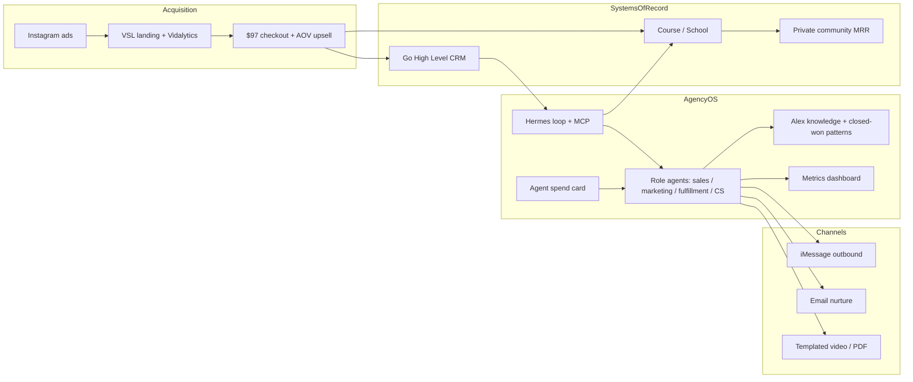

# AgencyOS Architecture (SSA Clone)

**Status:** Draft v0 from founder calls (2026-08-04)  
**Not yet:** production topology, schemas, or repo map — those land after Agent OS inventory is audited in the live environment.

---

## Problem the architecture solves

SSA today is an ads → VSL → checkout → course/upsell machine with a large but under-organized lead archive. AgencyOS must:

1. Raise front-end AOV and cut sales-call load.
2. Nurture/score historical + new leads in Alex’s voice.
3. Deliver student value via Agent OS without mis-modeling GHL ownership.
4. Produce dashboards and autonomous optimization loops (Hermes + MCP).
5. Create durable software/community value beyond ad-dependent info revenue.

---

## Logical system map



---

## Core components

| Component | Role |
|---|---|
| **Hermes + looping system** | Control loop: observe → decide → act → measure → store |
| **MCP tools** | Least-privilege connectors into GHL, messaging, docs, ads metrics |
| **Role Agent OS instances** | Optional split: sales, marketing, fulfillment, customer-service/nurture |
| **Alex knowledge base** | Life/context + closed-won talk tracks + 200 call transcripts |
| **Lead intelligence** | Score, ICP, drop-off analysis, message experiments |
| **Outbound fabric** | iMessage primary; email for open/click training; video/PDF drops |
| **Dashboard** | CAC, AOV, reply rate, email opens, School→community, ad health |
| **Agent spend card** | Bounded autonomy for docs, pages, experiments without Alex ping |
| **Student GHL** | Each student owns an **agency** GHL account (external to SSA hierarchy) |

---

## Data domains

1. **Lead archive (~5–6k):** contacts, tags, DM/SMS threads, qualification fields.
2. **Closed-won corpus:** conversations + outcomes used as training gold.
3. **Sales-call corpus (~200):** pains, objections, language for marketing/fulfillment.
4. **Funnel economics:** ad spend, CPP $70–140, AOV, upsell take rate.
5. **Engagement:** message reply scores, email opens/clicks, content consumption confirmations.
6. **Product usage:** School progress, community membership, any shipped software/tools.

---

## Control loop (target behavior)

```text
ingest GHL conversations + tags + call transcripts
  -> score leads + extract winning patterns
  -> hypothesize message / email / content
  -> send via iMessage (+ optional email/video)
  -> measure reply / open / click / invite / purchase
  -> update playbook + dashboard
  -> propose ad scale / pause / creative / School moves
```

Human gates stay on: production spend above card limits, outbound policy changes, pricing changes, equity, and anything touching protected accounts.

---

## GHL tenancy model (architectural law)

```text
SSA Agency GHL
  └── SSA internal sub-accounts (ops only)

Student Agency GHL  (purchased by student: 97 / 297 / 497 tiers)
  └── Student client sub-accounts
```

**Forbidden:** modeling students as SSA sub-accounts who then “need client sub-accounts.”

---

## Integration stance

| Need | Preference |
|---|---|
| CRM / pipelines / tags | Existing GHL |
| Workflow automation for students | Teach on their agency GHL; optional GHL Command affiliate or wait for GHL MCP |
| Founder ops AI | Hermes + MCP; do not invent a second control plane first |
| Messaging | iMessage outbound as specified; email secondary |
| Docs/pages from agents | Generated under spend-card policy into owned storage |

---

## Security / autonomy boundaries

- Agent card: capped spend, logged receipts, no unlimited production ads without approval.
- Outbound AI must be attributable to Alex voice policy; no spam patterns that burn domains/numbers.
- Closed-won data is privileged training set; do not mix failed threads as equal weight.
- Student GHL credentials are theirs — AgencyOS should guide setup, not hostage their tenancy.

---

## Build slices (architecture roadmap)

1. **Read-only GHL audit** — tags, buckets, conversation export paths.
2. **Closed-won miner** — pattern + ICP extraction.
3. **Dashboard v0** — manual metrics OK if automated path is designed.
4. **Nurture pilot** — small cohort, direct vs relationship, iMessage.
5. **AOV upsell asset** — tied to VSL promises.
6. **Hermes role split decision** — one org vs four.
7. **Community MRR offer** — pull-based, post-value.

---

## Related decisions

See `docs/decisions/` for locked ADRs (GHL tenancy, value-first monetization, Agent OS autonomy, message learning loop, GHL Command posture).
