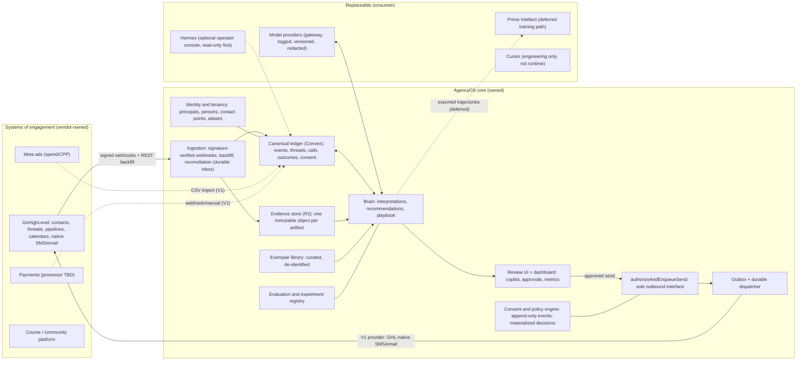

# AgencyOS Architecture

**Status:** Canonical. This is the single authoritative architecture for AgencyOS (SSA).
**Date:** 2026-08-08
**Consolidates and supersedes:** the draft v0 architecture (previously at this path) and the 2026-08-08 architecture review artifact (`agencyos-architecture-review-2026-08-08.md`, retained unedited for citation integrity).
**Adjudication record:** `docs/architecture/agencyos-audit-adjudication-2026-08-08.md` documents how the 2026-08-08 independent audit was resolved into this document.
**Nothing in this document is implemented.** The repository is documentation-only; all code paths named below are proposed.

---

## 0. How to read this document

This architecture answers: *given what Alex and Kamal are actually trying to accomplish, what should AgencyOS be, and what is the correct technical path from today's documentation-only repository to that product?*

It is self-contained: an engineer or agent with no access to the originating conversations can understand, critique, and implement against it. §1–§3 establish evidence and invariants. §4–§15 are the design. §16–§17 scope V1 and the roadmap. §18 is the decision register. §19 lists open questions honestly.

Transcript citations use the form `[call-01 0018–0025]`, meaning a timestamped segment range in `docs/founder-context/transcripts/alex-call-01.segments.txt`.

---

## 1. Evidence base and verified platform facts

### 1.1 Sources

| Source | Role |
|---|---|
| `docs/founder-context/transcripts/alex-call-01.{txt,segments.txt}` (~7.7 min) | Primary founder evidence |
| `docs/founder-context/transcripts/alex-call-02.{txt,segments.txt}` (~12.8 min) | Primary founder evidence |
| `docs/founder-context/alex-call-01.md`, `alex-call-02.md` | Curated summaries (checked against raw; consistent) |
| `docs/founder-context/agencyos-current-strategy.md`, `founder-intent.md` | Historical strategy/intent snapshots |
| `docs/decisions/ADR-001…007` | Decision record; dispositions in §18 |
| `agencyos-architecture-audit.canvas.tsx` | Independent audit (2026-08-08); adjudicated in the companion record |

### 1.2 Repository reality

As of 2026-08-08 the repository contains documentation only: no application code, schema, tests, package manifest, or CI. The first commit (`7c9e19e`) exists and is pushed to a private remote. No security, reliability, or isolation claim below may be credited as implemented until code and tests exist.

The real assets live outside the repo: ~5–6k leads with tags and DM/SMS threads in SSA's GoHighLevel account `[call-01 0366–0387]`; ~200 sales-call recordings/transcripts (physical location unverified) `[call-02 0614–0623]`; a live $97 VSL funnel with CPP $70–140 `[call-01 0038–0111]`; a course/community; 40+ testimonials and Alex's cash reserves `[call-02 0265–0301]`.

### 1.3 Platform facts verified against first-party documentation (as of 2026-08-08)

These facts are load-bearing; the design treats them as constraints, not assumptions.

| Fact | Verified state |
|---|---|
| GHL event webhooks (`ContactCreate/Update`, `InboundMessage`, `OutboundMessage`, `Opportunity*`, `Appointment*`, `InvoicePaid`, …) | Delivered as **Marketplace app (OAuth) subscriptions**. A Private Integration Token (PIT) is for internal REST access and does not provide app event subscriptions. Workflow "webhook" actions fire only when a configured workflow reaches that action — they are not a generic event stream |
| GHL webhook authenticity | Since **2026-07-01**, marketplace webhooks are signed **only** with `X-GHL-Signature` (Ed25519); the legacy RSA `x-wh-signature` is retired. Verification must run over the **raw request bytes** before parsing |
| GHL Private app distribution | Private Marketplace apps (created on/after 2025-11-18) are capped at **5 unique agency installs**; the 6th is blocked until the app is published publicly or passes GHL Security Review |
| GHL conversations/backfill | Export endpoints are channel/type-qualified; export cursors are short-lived; email bodies hydrate via separate endpoints; actor/source attribution fields are optional. Contacts are location-scoped and **can be merged** (one contact retained) |
| Convex execution | Queries/mutations are transactional and retried; **actions are at-most-once and never auto-retried** (side effects can't be safely replayed). Durable multi-step jobs use the Workflow/Workpool components |
| Convex authorization | Application-level. There is no database-enforced row security; every public function must implement authorization in code |
| Convex backup/export | Snapshot covers **table data + file storage only** — not code, config, environment variables, or pending scheduled functions |
| Cloudflare R2 | Strongly consistent; concurrent writes to one key are **last-writer-wins**; there is **no append** primitive. Jurisdiction is fixed at bucket creation and cannot be changed |
| TCPA/FCC (US) | Revocation rules effective 2025-04-11: honor **any reasonable revocation method** (including STOP/QUIT/END/REVOKE/OPT OUT/CANCEL/UNSUBSCRIBE) within ≤10 business days. The "revoke-all-topics" scope rule is waived until **2027-01-31** (FCC DA-26-12) — this design honors revocation globally anyway. Marketing texts require prior express written consent; telemarketing quiet hours are 8am–9pm recipient-local; state mini-TCPAs (FL, OK, WA, …) can be stricter |
| CAN-SPAM (email) | Accurate sender identity, postal address, functioning opt-out honored within 10 business days |
| Call recording law | Federal baseline is one-party consent (18 U.S.C. §2511); California (Penal §632), Florida (§934.03) and other states require all-party consent. Lawful capture, present ownership/license, and permission to disclose to processors are **separate facts** |
| iMessage automation | No official Apple API; bridges (Sendblue-class) are unofficial infrastructure with account-flagging risk. TCPA applies regardless of channel |
| Hermes (`NousResearch/hermes-agent`) | Fast-moving personal agent runtime with agent-curated memory; unsuitable as a system of record |
| Prime Intellect | Credible deferred training/serving destination (`prime-rl`, Environments Hub, LoRA serving); Prime Agent is a coding/research tool, not a sales runtime |

---

## 2. Founder intent

### 2.1 What Alex and Kamal are building

Four goals, in Alex's own words:

1. **Fix front-end unit economics before scaling ads.** CPP $70–140 against a $97 offer; an AOV upsell ("a tool… a feature… something that helps the new students get customers, make money faster") is the unlock for more ad spend `[call-01 0119–0150]`.
2. **Replace the expensive-confusion ladder with cheaper competence.** Inner Circle was $5–7k, DFY $25k; lower price, raise delivered value, mitigate risk `[call-01 0151–0190]`.
3. **Create enterprise value that survives ads being turned off** — "something that they all use and become users… that we can end up selling one day" `[call-01 0222–0258]`; opt-in community at $100–200/mo `[call-02 0030–0083]`.
4. **An AI that works the lead base like Alex and eventually helps run the business** — scan every conversation, score leads, learn why closed deals closed, build ICP from closed buyers, run hypothesis → send → score → optimize loops, nurture in Alex's voice with human cadence, mine the 200 call transcripts; long-term an agent with a spend card that audits the business `[call-02 0303–0768]`.

Two operational asks are explicit and start **at day zero**, not at autonomy: a written budget and game plan, and a funded card so work proceeds without pinging Alex for every purchase — "needs a card with money on it so you can begin the process… We need to come up with the budget" `[call-01 0018–0033]`. That card is an operating instrument held by a human (Kamal). The *agent's* card ("give him a card… where he can spend money" `[call-02 0686–0722]`) is a separate, later instrument gated on earned autonomy (§17 Phase 4).

Partnership shape: Kamal brings organization, patience, technical execution; Alex brings sales, marketing, speed, cash, the lead archive, testimonials; Manny is in the operating core with a role to be defined `[call-01 0329–0365]`, `[call-02 0232–0259]`. Alex's mission framing (money, helping people, faith, learning AI) shapes tone policy, not topology `[call-01 0416–0434]`.

### 2.2 The objective

The transcripts contain four candidate objectives: language imitation, procedure imitation, decision imitation, and outcome optimization. The objective is **(4) outcome optimization**, with (1)–(2) as the bootstrap prior and standing brand constraints, and (3) as the intermediate stage whose purpose is accumulating paired (context, Alex-action, AI-recommendation, outcome) records. Alex himself specifies an experiment loop, not a parrot: "comes up with a hypothesis… starts that experiment, tracks that data and continuously optimizes" `[call-02 0432–0477]`.

The compounding, sellable asset is therefore not a model that talks like Alex — any frontier model with a style corpus can do that. It is the **proprietary evidence ledger**: the only dataset recording how this business's leads respond to specific actions, joined to revenue outcomes, plus the evaluation infrastructure that turns that ledger into better decisions. Models are interchangeable consumers of that asset.

### 2.3 Implied requirements Alex never stated

1. **An owned, durable data foundation** — "the AI scans and becomes smarter" presumes the learning accumulates somewhere SSA owns.
2. **Reliable outcome labels before learning** — buckets are unclear today `[call-01 0366–0387]`; hygiene precedes intelligence.
3. **Consent and messaging compliance** — never mentioned in either call; texting thousands of aged leads is squarely regulated territory and the largest unpriced risk (§6).
4. **Processing rights for recordings** — lawful capture, ownership, and vendor-disclosure permission must be proven per call before transcription or mining (§10).
5. **Human review before the AI speaks as Alex** — every mistake is attributed to Alex personally.
6. **Statistical honesty** — "more tags = more likely to buy" `[call-02 0646–0661]` is correlational; mined patterns are hypotheses to test, or the system optimizes noise.
7. **Adversarial-content defense** — lead messages, files, and CRM fields are attacker-controllable input to a system that will eventually hold send and spend authority (§12).

---

## 3. Architectural invariants

Every component and phase must preserve these. A change that breaks one is a redesign, not an iteration.

- **I1 — Five-class separation.** Raw evidence, canonical structured data, AI interpretations, human actions, and AI recommendations are distinct, permanently distinguishable record classes (§9). Outcomes are canonical data derived from evidence.
- **I2 — Event-time honesty.** Every record carries `occurredAt` and `observedAt` (when AgencyOS learned it). An evaluation as of time T may read only records with `observedAt ≤ T`. No feature, retrieval result, or label may leak information from after the decision it evaluates (§9.3, §11).
- **I3 — Consent enforcement, honestly scoped.** Every AgencyOS-originated outbound side effect passes one authorization operation (`authorizeAndEnqueueSend`); nothing else in the system holds provider credentials. Sends that originate natively in GHL are **observed, not enforced**, and are never claimed otherwise (§6).
- **I4 — Tenant isolation by construction.** Tenant scope is derived server-side from the authenticated principal through one authorization helper on every public entrypoint. No data crosses tenants except through explicit, audited, opt-in aggregation (§5, §15).
- **I5 — Untrusted content never becomes instructions.** All CRM, lead, file, transcript, retrieval, and tool text is data, never system/developer instruction (§12).
- **I6 — Attributable AI.** Every interpretation and recommendation records model, prompt/template version, source evidence IDs, and creation time; every displayed draft has an immutable ID so human reuse is traceable (§9, §11).
- **I7 — Replaceable consumers.** GHL, Convex, model providers, Hermes, and Prime Intellect are each replaceable without losing the proprietary asset (ledger + evidence + evals). Exit paths are designed, not hoped for (§14).
- **I8 — Earned, scoped, reversible autonomy.** Autonomy grants are per (segment × action type × channel), backed by prospective safety and mature outcome evidence, individually revocable, and covered by a single global kill switch (§11.6).

---

## 4. System shape

One owned backend (ledger + brain), one CRM (GHL), one review surface, thin adapters — agents and models as replaceable consumers, never owners of state.



**Component responsibilities** (each: owns / why / lock-in posture):

- **GoHighLevel — system of engagement.** Owns operational contact/thread/pipeline state; never owns interpretations, outcome joins, experiments, evaluation state, or consent decisions. Incumbent, verified API surface, and students will run their own GHL agencies (ADR-001). AgencyOS writes to GHL only through the outbox send path — it does not edit contacts/opportunities in V1, eliminating bidirectional sync conflicts. Lock-in bounded by §14.
- **AgencyOS core — Convex.** The single owned system of record for the ledger, interpretations, recommendations, experiments/evals, consent, and playbook; hosts HTTP webhook receivers, scheduled reconciliation, and durable pipelines (Workflow component). Chosen because one engineer needs transactional writes, durable scheduling, reactive queries, FTS + vector search, and file handling without operating servers or queues. Justified **conditional on the export discipline in §14**.
- **Evidence store — Cloudflare R2 (or S3).** The immutable forensic layer (§8.3). Cheap, portable, survives every other vendor decision. Jurisdiction and lifecycle rules are chosen at bucket creation (§13.5).
- **Consent & policy engine + send gate.** §6. The gate is the only code path holding channel-provider credentials.
- **Brain.** Versioned interpretation pipelines, the recommender (§11), and the human-ratified playbook. Consumes models through a logging gateway (§13.4).
- **Exemplar library.** The only cross-lead content that may enter a live prompt: curated, de-identified, human-approved patterns (§12.2).
- **Review UI + dashboard.** Thread view with full context; draft + rationale beside every decision point; approve/edit/reject with labels captured; audit views; experiment results; funnel metrics (CAC, AOV, reply/booking/close, revenue-with-ads-paused).
- **Cursor** — writes all production code; never a runtime component. **Hermes** — optional phase-3+ operator console (Telegram-style "what happened today"), read-only MCP first; approval actions only through the same consent-gated APIs the UI uses; zero SSA-critical state in Hermes sessions/skills/vaults. **Prime Intellect** — deferred training/serving destination; today's only obligation is exportable trajectories (schema decision, not dependency).

**Deliberately absent:** orchestration frameworks, separate vector DB, Kafka/queues, data warehouse, multi-agent role topology, Mac Mini dependency, GHL-clone tooling. Each absence is a decision; the burden of proof sits with whoever adds one back.

---

## 5. Identity and tenancy

An `agencyId` column is a partition key, not a security boundary or a person. Both concepts get first-class models.

### 5.1 Principals and authorization

- Tables: `principal` (human or service identity), `membership` (principal × tenant × role), `role` (owner / operator / engineer-admin / service:ingest / service:brain / service:dispatch).
- **One authorization helper wraps every public query, mutation, action, HTTP endpoint, scheduled job, search (FTS and vector), and export job.** It authenticates the principal, derives tenant scope server-side, and injects it into the query context. Client-supplied tenant IDs are never trusted as authorization. Convex document IDs are unguessable but every fetched document is still ownership-checked against the derived scope.
- Enforcement is testable: CI includes cross-tenant probes — foreign IDs, pagination cursors, full-text and vector queries, HTTP routes, scheduled jobs, exports, and credential access must all fail closed (§15.3).
- If a future contract requires hard isolation beyond application-level guarantees, that tenant gets a separate Convex deployment; the schema supports this because no cross-tenant join exists to break.

### 5.2 Persons, contact points, and source contacts

GHL contact IDs are location-scoped and contacts can merge; a CRM row is not a stable person, contact point, or consent subject. Therefore:

- `person` — tenant-scoped canonical human.
- `contactPoint` — person × type (phone/email/IG handle) × value, with verification state. Consent and suppression attach here (§6).
- `sourceContact` — external record keyed (vendor, locationId, externalContactId), with raw payload pointer.
- `identityLink` — sourceContact → person with method (exact match / fuzzy / human), confidence, and timestamps.
- **Merge/split provenance:** GHL merges append an `identityEvent`; the losing contact's history is never deleted. **Suppression union rule:** if any alias or contact point of a person has opted out, the person is suppressed for that channel/purpose — merges can only widen suppression, never narrow it.

### 5.3 What is shared across tenants, and what never is

| Shared (the product) | Never shared |
|---|---|
| Code, schema, pipelines, prompt templates, policy engine | Any tenant's raw threads, transcripts, contact PII |
| SSA-authored playbook content SSA chooses to license | SSA's ledger and Alex's private corpus (this *is* the proprietary asset) |
| Opt-in, aggregated, k-anonymized benchmarks (later; explicit consent; aggregate-only) | Cross-tenant lookalike retrieval; "learn from other students' leads" |

---

## 6. Consent and outbound policy

### 6.1 Consent as an event-sourced ledger

- `consentEvent` (append-only): grant, revocation, suppression, or correction — with evidence: source (form URL, checkbox text, message), capture timestamp, disclosure version, scope (channel, purpose, seller), and raw evidence pointer.
- Materialized `policyState` keyed **(tenant, person, contactPoint, channel, purpose, seller)**. Purposes: `promotional`, `informational`, `account_service`. Dual-purpose content is classified promotional. The seller key costs one field now and makes multi-tenant consent correct later.
- States: `provable_optin` (evidence on file) / `unverified_claim` (history implies consent but no evidence located) / `none` / `revoked`, plus suppression flags (opt-out keyword, complaint, DNC-listed, reassigned-number-suspect, legal hold).
- **Sendability:** promotional SMS/iMessage requires `provable_optin` (prior express written consent). `unverified_claim` and `none` are non-sendable for promotional text messaging — no exceptions, including reactivation campaigns. Email follows CAN-SPAM (suppression binding, identification requirements). Informational/account messages follow their own consent basis per policy table.
- **Historical inference is an interpretation, not a fact.** Consent posture inferred from the 5–6k-lead history is class-3 data (§9) until a human/counsel verification pass upgrades specific segments to `provable_optin` with evidence attached.

### 6.2 Revocation, timing, and hygiene

- Honor **any reasonable revocation expression** across channels (keyword set plus free-text classification with human review of ambiguous cases). Suppression is applied immediately on detection; ≤10 business days is the legal ceiling, not the target.
- Revocation is **global by default** — one opt-out suppresses all purposes and campaigns for that person/channel (ahead of the FCC revoke-all rule effective 2027-01-31).
- Quiet hours: 8am–9pm recipient-local for anything promotional. Unknown timezone → resolve first or apply the most restrictive plausible window. Frequency caps per person × channel × rolling window. Value-first tone constraints (ADR-002) are hard policy, not preferences.
- Dormant-base hygiene before any reactivation arm: DNC registry check and Reassigned Numbers Database query for numbers aged past their last confirmed contact.

### 6.3 Enforcement boundary — stated honestly

- **`authorizeAndEnqueueSend` is the only interface for every AgencyOS-controlled outbound side effect.** It evaluates policy (consent state, suppression, quiet hours, caps, tone/policy version), records the decision output (including denials) as evidence, and enqueues an outbox intent (§8.2). Policy is re-checked at dispatch time; revocation cancels queued intents. Agents, pipelines, and UI code receive no provider credentials.
- **GHL-native sends (Alex working manually, or GHL workflows) are observed, not enforced.** They arrive as `OutboundMessage` events, are attributed and counted against caps, and are reconciled — but AgencyOS cannot intercept them and never claims to. Operational containment: GHL-native bulk/marketing automations are disabled for uncleared segments; Alex's personal 1:1 replies remain his human responsibility, informed by the audit report's per-segment consent posture (§17 Phase 1).
- AgencyOS never initiates or queues contact to a destination whose policy state is non-sendable, in any phase.

---

## 7. GoHighLevel integration: credentials, events, backfill

### 7.1 Credentials

Two credentials with different jobs, from Phase 0:

1. **Private Marketplace OAuth app (unlisted)** — the event front door. Provides app-level webhook subscriptions (the lifecycle events in §7.2), install/uninstall lifecycle, and later becomes the multi-tenant onboarding path. Token lifecycle (authorization code → access/refresh tokens, per-location token exchange, revocation, uninstall webhooks) is designed at creation, not retrofitted.
2. **Private Integration Token (PIT)** — least-privilege REST credential for backfill and reconciliation queries. Rotated on schedule; stored as a secret; never in client code.

**Distribution ceiling is a first-class product constraint:** private apps are capped at 5 unique agency installs; the 6th is blocked until public listing or GHL Security Review. Security review preparation is scheduled before the sixth tenant (§17 Phase 5), not discovered at it.

### 7.2 Event transport matrix

No event is "covered" until it has a row here **and** a captured, signature-verified sandbox fixture replayed through the ingestion path. Initial required rows:

| Event | Transport | Credential | Verification | Replay key | Ordering key | Reconciliation query |
|---|---|---|---|---|---|---|
| `InboundMessage` | Marketplace app webhook | OAuth app | Ed25519 raw-byte | messageId | conversationId + ts | conversations/messages since-cursor |
| `OutboundMessage` | Marketplace app webhook | OAuth app | Ed25519 raw-byte | messageId | conversationId + ts | same |
| `ContactCreate/Update` | Marketplace app webhook | OAuth app | Ed25519 raw-byte | contactId + eventTs | contactId | contacts search modified-since |
| `OpportunityCreate/StageUpdate/StatusUpdate` | Marketplace app webhook | OAuth app | Ed25519 raw-byte | opportunityId + eventTs | opportunityId | opportunities search |
| `AppointmentCreate/Update/Delete` | Marketplace app webhook | OAuth app | Ed25519 raw-byte | appointmentId + eventTs | calendarId | calendar events range |
| `InvoicePaid` / `OrderStatusUpdate` | Marketplace app webhook | OAuth app | Ed25519 raw-byte | invoiceId/orderId + eventTs | contactId | payments/orders list |
| App `INSTALL` / `UNINSTALL` | Default webhook URL | OAuth app | Ed25519 raw-byte | installId | companyId | installedLocations |
| Custom workflow webhooks (only if a GHL workflow must signal AgencyOS) | Workflow action | Per-workflow rotating shared secret | Secret compare + payload schema | workflowExecutionId | n/a | none — treated as hints, never authoritative |

**Signature rule:** verify `X-GHL-Signature` (Ed25519) over raw bytes before any parsing; reject on failure; no legacy fallback (retired 2026-07-01). Workflow webhooks have a separate rotating-secret contract and are advisory only.

### 7.3 Backfill contract

Backfill of the 5–6k contacts, threads, and opportunity/tag history is a defined, resumable pipeline, not a loop over an export:

- **Completeness is declared per channel and message type** (SMS, IG/FB DM, email, calls), each with an explicit denominator derived from reconciliation queries — never a blanket "≥95% of threads."
- Short-lived export cursors are consumed immediately; durable progress is checkpointed as (channel, date/ID window) records so any crash resumes without loss or double-count.
- Email bodies hydrate through their separate endpoints as a distinct sub-pipeline.
- **Native actor attribution is nullable.** Whether Alex or Manny sent a given historical message is recorded as `attributedActor` with `confidence: unknown` unless the payload proves it. No pipeline treats unattributed sends as Alex's behavior (§11.4).
- Backfilled current-state fields (tags, opportunity stage) are stamped `observedAt = backfillTime`, **not** treated as contemporaneous with the historical thread (I2). Historical feature reconstruction uses only records whose `observedAt` supports it.
- Rate-limit budgets and resumability are stated per job; ManyChat/IG-era coverage gaps are measured and reported, not assumed away (§19).

---

## 8. Reliability and evidence durability

### 8.1 Inbound: durable inbox

- Every webhook delivery is archived raw (§8.3) and recorded as an `inboundReceipt` with deterministic ID `hash(source, replayKey)`. Duplicate deliveries hit the same receipt: **one ledger row and one evidence object** per logical event.
- Upserts into canonical tables are idempotent on external IDs. Ordering is restored via ordering keys, not assumed from arrival.
- Nightly reconciliation sweeps (list-since cursors per §7.2) catch dropped events; drift repairs are logged as corrections with provenance (§9.2).

### 8.2 Outbound: outbox with explicit uncertainty

Convex actions are at-most-once and not auto-retried; provider timeouts are ambiguous. Therefore:

- `sendIntent` (written transactionally with the authorization decision): intentId, idempotencyKey, policyDecisionId, payload pointer, state machine `pending → authorized → dispatched → sent | failed | unknown`.
- Each dispatch attempt has a deterministic `attemptId` passed to the provider where supported; provider message IDs are recorded on receipt.
- **`unknown` is a first-class state.** An ambiguous outcome (timeout, crash between dispatch and acknowledgment) is reconciled against provider/GHL state *before* any retry. No blind retries of side effects.
- The dispatcher runs on the durable Workflow component; policy is re-evaluated at dispatch (§6.3).
- Failure-injection tests exercise every boundary: crash between R2 archive and Convex upsert, between upsert and ack, between authorization and dispatch, between dispatch and provider ack. Phase 0 does not exit until these pass (§17).

### 8.3 Evidence store semantics

R2 objects are last-writer-wins with no append primitive, so "append-only JSONL" is not a durability contract. Instead:

- **One immutable object per artifact** — webhook payload, call audio file, transcript version, model I/O record — under a deterministic key: `{tenant}/{class}/{externalId or receiptId}/{artifactVersion}`.
- Object metadata records content hash, size, tenant, and retention class. Objects are never rewritten; a corrected artifact is a new version object.
- Compaction into JSONL/Parquet for analytics/export is a **derived batch output** to separate keys — never a read-merge-reupload of the evidence objects themselves.
- Bucket protection: versioning and finite bucket-lock policies consistent with the retention matrix (§13.2) — locks must not conflict with the purge machine (§13.3).

---

## 9. Canonical data model and provenance

### 9.1 The five classes (I1)

1. **Raw evidence** (immutable; R2 + ledger pointers): webhook payloads, message bodies, audio, diarized transcripts, model I/O logs. Never edited, never summarized-in-place; deletable only via the purge machine within retention policy.
2. **Canonical structured data** (versioned, human-correctable): persons, contact points, threads, appointments, outcome labels, consent states. Corrections keep who/what/when/why history. The only class humans may edit. **Business outcomes live here**, derived from evidence-class events — they are the dependent variable of the whole system.
3. **AI-derived interpretations** (append-only, versioned): summaries, extracted objections/pains, lead scores, ICP features, drop-off classifications, inferred consent posture. Each row carries `{model, promptVersion, sourceEvidenceIds[], spanRefs?, confidence, createdAt}`. Re-runs add versions; v1 remains. `humanVerified: true` — granted by review, never by generation — is what elevates trust.
4. **Human actions** (facts): sends, edits, call dispositions, approvals/rejections with reasons. Assistance labeling per §11.4.
5. **AI recommendations** (facts about the AI): what the system proposed, timestamped **before** the corresponding human action, with rationale, confidence, model/prompt/playbook versions, and an immutable draft ID. Never mutated after creation.

### 9.2 Provenance rules

1. Every interpretation references evidence IDs; the UI renders "show source" down to transcript spans.
2. No pipeline reads an interpretation as input to another interpretation without carrying the full provenance chain (no laundering).
3. Anything unverified renders visibly as AI-derived.
4. The playbook contains only entries that are human-authored or human-promoted from experiments; each promoted entry records **which experiment earned it**.
5. Prompt/model version changes create new interpretation versions; dashboards can pin or compare.

### 9.3 Event-time discipline (I2)

- Every ledger record carries `occurredAt` (when the event happened in the world) and `observedAt` (when AgencyOS learned it). Backfilled state is stamped with backfill-time `observedAt` (§7.3).
- Threads, campaigns, and outcomes carry **policy-era fields**: offerId, pricePoint, campaignId, source, channel, policyEra (e.g., `2024-hard-upsell`, `2026-value-first`). Historical wins from an abandoned sales regime are contrast/hypothesis evidence, not success labels, unless era-compatible with current policy (ADR-002/ADR-004).
- Any query powering an evaluation, feature, or retrieval at decision time T filters `observedAt ≤ T`. This is a shared library constraint, not per-pipeline discipline.

### 9.4 What AI may and may not do

**May (as hypotheses):** score lead fit; classify thread state; extract objections/pains; draft replies; propose experiment variants; flag anomalies.
**May not:** silently change canonical fields; mark its own inferences verified; treat mined correlations as causal; auto-promote patterns into the playbook; contact anyone; touch provider credentials.

---

## 10. Call intelligence

### 10.1 Rights before processing

Lawful recording at capture, present ownership/license, participant jurisdictions, and permission to disclose to processors are separate facts, and none is assumed. The pipeline order is:

```text
inventory (metadata only) → rights manifest → acquire → archive → transcribe + diarize → extract → link → aggregate
```

1. **Inventory without media.** Enumerate the ~200 recordings' metadata (source system, date, participants, duration) without copying audio.
2. **Per-call rights manifest** — required before download, archive, transcription, retrieval, or model use: source/owner and license; participant jurisdictions (one-party vs all-party); notice/consent evidence at capture; permitted purposes; processor permissions (which vendors may receive it); retention class.
3. **Quarantine by default.** Recordings without a completed manifest are counted and quarantined — not processed.
4. **Narrow expiry exception:** where a documented risk of source deletion exists (e.g., recorder retention windows), a **storage-only quarantine copy** may be taken into a locked, access-restricted bucket prefix before full clearance — with owner sign-off recorded, no vendor disclosure, no transcription, no indexing, no model access, and scheduled deletion if rights are not established within the review window. This trades a bounded, controlled holding risk against irreversible evidence loss; it grants zero processing rights.

### 10.2 Cleared-call pipeline

- **Archive:** audio → evidence object (§8.3); the raw file is the root of every downstream claim.
- **Transcribe + diarize:** word/segment timestamps; GHL's native transcription is an acceptable first source where the call lives in GHL; re-transcription is a versioned re-run, never an overwrite. Long jobs run as chunked durable workflows or external workers, not single serverless invocations.
- **Extract (interpretation, versioned):** objections, pains, promises, price discussions, competitor mentions, next-step commitments — every item carrying `spanRefs: [{startTs, endTs}]`.
- **Link:** call ↔ person ↔ opportunity ↔ outcome; extracted "next steps" become checkable against what actually happened.
- **Aggregate:** pain/objection taxonomy across the corpus `[call-02 0614–0639]`, feeding messaging, VSL/checkout revision (ADR-004), and nurture content selection. Every aggregate claim decomposes to call IDs and spans.

---

## 11. Learning and evaluation governance

### 11.1 Alex Clone progression

| Stage | What it is | Exit criterion |
|---|---|---|
| 0. Knowledge & style base | Curated Alex corpus: approved life facts `[call-02 0538–0551]`, tone rules, value-first constraints, style exemplars | Alex signs off on style guide + forbidden-content list |
| 1. Language imitation | Drafts in Alex's voice, copilot only | ≥70–80% drafts accepted with minor edits across ≥100 real decisions |
| 2. Procedure imitation | Cadence/follow-up policies as explicit inspectable rules (leave-on-read ~1.5d, send-then-ask `[call-02 0568–0597, 0677–0686]`) | Policies run in copilot with zero violations |
| 3. Decision imitation (shadow) | Recommends which action before Alex acts | Agreement + preference stable on ≥50-decision rolling windows |
| 4. Outcome optimization | Randomized variants; playbook updates only via measured lift | Sustained lift vs control with zero consent/tone violations |

**Style stays imitative permanently** — voice is a brand constraint, not an optimization target. Procedures and decisions graduate to optimization on tier-3 evidence; when outcomes contradict Alex's habits, the system presents evidence and **Alex ratifies** the playbook change. The objective function is stagewise (reply → booked → closed → retained) with ADR-002 constraints hard-coded; reply-rate maximization alone rediscovers spam.

### 11.2 Dataset governance (I2 applied)

- **Evaluation examples are immutable `asOfDecisionTs` snapshots** with hidden action/outcome labels. Every feature satisfies `observedAt ≤ decisionTs`.
- **Splits are by normalized person and time:** exemplar/training, development, and a **frozen core test set** (≥50 curated decisions from closed-won *and* well-understood losses) used only at declared milestones — plus a **prospective pool** that accumulates from live shadow decisions and refreshes evaluation without unfreezing the core.
- **Retrieval and mining exclusions:** the evaluated person/thread, all post-decision records, and all experiment holdouts are excluded from retrieval indexes, playbook mining, and score fitting for that evaluation. Enforced by the shared event-time library, not by convention.
- **Policy-era honesty:** old high-ticket/hard-upsell wins are contrast evidence unless era-compatible (§9.3).
- Verified outcome labels and an offline-eval pass are prerequisites for any lead-facing rollout.

### 11.3 Offline evaluation

Replay against the frozen core + prospective pool on every prompt/model/playbook change: action-type agreement, human-graded acceptance-in-hindsight, score calibration — reported with intervals, action-type and timing separated from content similarity so verbosity can't inflate scores. The **prompt-injection fixture suite (§12.4) is part of offline evals**; a regression blocks promotion.

### 11.4 Shadow mode

At every decision point (inbound message, follow-up timer, no-show, new lead):

1. Snapshot decision context `{threadState, leadState, playbookVersion, timestamp}`.
2. Write the immutable recommendation record **before** Alex acts; late generations are flagged `postHoc: true` and excluded from agreement metrics.
3. Alex works normally — in GHL or the review UI. His action arrives via `OutboundMessage` webhook or UI event and is linked.
4. Comparison: action-type agreement, semantic similarity, timing delta; divergences queue optional one-tap feedback, captured **before** the outcome is known.
5. **Outcomes attach only to the executed action.** An unexecuted recommendation has no observable outcome; it remains `executed: false` and may carry a `factualOutcomeRef` for audit, but is excluded from all reward and performance calculations. "When we disagreed, whose choice won?" is unanswerable from shadow data and is not asked of it; prediction calibration (predicted vs. actual outcome of the executed action) is the honest substitute.

**Assistance lineage:** every displayed draft has an immutable ID; UI-gated sends record exact edit lineage (draftId, editDistance). GHL-originated sends default to `assistanceUnknown` — never `humanOnly` — because a webhook cannot reveal whether Alex copied a draft. The **pure imitation corpus contains only verified human-only actions**; `assisted`/`assistanceUnknown` actions evaluate the joint human–AI policy only. This prevents the system from learning from its own text while reporting it as Alex.

### 11.5 Prospective experiments

The only path to playbook promotion and causal claims:

- **Registration before launch:** hypothesis, primary metric, outcome horizon (`outcomeMatureAt` rule), minimum detectable effect and power note, eligibility criteria, exclusions, arms, stopping rule, multiplicity handling, `preregisteredAt`.
- **Assignment: randomize once per normalized person** per experiment (not per lead row, not per thread). Persisted: eligibility snapshot, assignment, every attempt, delivery state, exact payload including human edits.
- **Analysis: intent-to-treat** on mature cohorts only. Small-sample honesty: intervals, not point estimates; few big-swing tests over many underpowered micro-tests.
- **Holdout protection:** holdout persons are excluded from retrieval, score fitting, and playbook mining for the experiment's duration (§11.2).
- Reactivation campaigns carry standing holdout groups; first experiments start where brand risk is lowest (dormant segments, post-consent-clearance).

### 11.6 Autonomy gates (I8)

- Agreement/acceptance rates are **imitation-UX metrics only**. They gate copilot ergonomics, never send authority.
- Each autonomy grant is scoped (segment × action type × channel) and requires: (a) a prospective safety window with zero policy violations, and (b) **mature outcome evidence from randomized assisted-champion vs. autonomous-challenger traffic** — never a sequential before/after rollout.
- Every grant is individually revocable; the kill switch disables all `ai-auto` actors globally in one mutation and is fire-drilled before Phase 4 exit.
- Agent-initiated spend (the card Alex described) is a Phase-4+ instrument with caps, receipts into the ledger, and owner gates for large/irreversible spends — distinct from the Phase-0 human operating card (§17).

### 11.7 Fine-tuning: deferred by design

Prompted frontier models + retrieval over the curated corpus outperform a small fine-tune at current volumes (closed-won set is likely tens-to-hundreds; counted in Phase 1). Weights can't show provenance; prompts + retrieval can. Trigger to revisit: ≥500–1,000 high-quality decision records with outcomes, leak-resistant evals in place, and a measured gap prompted models can't close. Trajectories (context, action, outcome) stay exportable from day one so the Prime Intellect-class path stays cheap to start.

---

## 12. Agent trust boundary

### 12.1 Threat model

Lead messages, transcripts, uploaded files, CRM fields, and tool results are attacker-controllable. A malicious lead or document must not be able to exfiltrate another person's data, poison the playbook, emit malicious links, or trigger sends/spend. Tenant scoping alone does not prevent **cross-lead** disclosure inside a tenant.

### 12.2 Two retrieval domains

1. **Current person/thread domain:** the live lead's own messages, calls, and history — retrieved raw into their drafting context.
2. **Exemplar library:** the only cross-lead content permitted in a live prompt — de-identified, human-approved patterns and playbook entries, each recording its source and approval.

Arbitrary other-lead raw threads are **never** retrieved into a live response. The founders' "scan every conversation" intent `[call-02 0378–0451]` is preserved where it belongs: offline mining pipelines read the whole corpus and emit interpretations and candidate exemplars, which reach live contexts only after curation.

### 12.3 Structural rules

- All untrusted content is delimited as data and never concatenated into system/developer instructions (I5).
- The recommender holds **no secrets and no side-effect tools**; it emits typed JSON validated deterministically (schema, then policy).
- Output controls on drafts: DLP screen for other-person PII, link policy (allowlisted domains only), claim constraints from the style/policy gate.
- Interpretation pipelines run content-isolated: one lead's content per invocation; cross-lead aggregation happens over structured outputs, not raw-text concatenation.

### 12.4 Injection evaluation and future tools

A prompt-injection fixture suite (instruction-smuggling in messages, transcripts, filenames, links) runs in offline evals from Phase 2; regressions block promotion (§11.3). Before any autonomous sends, spend, or write-capable MCP exposure (Phase 4–5): least-privilege capability tokens per tool, deterministic validators on every tool call, explicit approval for side effects outside granted scopes, and red-team fixtures extended to tool-call hijacking.

---

## 13. Privacy, retention, and access

### 13.1 Data inventory and processors

Every data class in §9 has an inventory row: purpose, legal basis posture, store(s), retention class, and processors. Model providers, transcription vendors, and any iMessage bridge are **data processors requiring DPA review and an allowlist entry before receiving a single record**. The processor inventory (including subprocessors, residency, and cross-border transfer posture) is completed before the historical corpus is copied anywhere (Phase 1 gate).

### 13.2 Retention matrix (defaults; ratified in ADR-011)

| Class | Default retention | Notes |
|---|---|---|
| Raw webhook payloads / message bodies | 3 years | evidence class |
| Call audio | 2 years | rights manifest may shorten |
| Transcripts + extractions | 3 years | versioned |
| Model I/O logs (redacted) | 1 year | §13.4 |
| Model I/O full payloads (opt-in) | 30 days | access-restricted |
| Consent evidence + suppression tombstones | indefinite | proof must outlive content |
| Operational backups | 35 days rolling | §14.1 |
| Exports | rotate; current + last quarter | §14.2 |

### 13.3 Deletion: an idempotent purge machine

Contact-level purge runs a resumable state machine: `requested → identity-validated → holds-checked → canonical-tombstoned → derived-purged (interpretations, FTS/vector indexes) → evidence-objects-deleted (all versions) → exports-rotated → vendor-erasure-requested → receipts-recorded → closed`. Legal holds pause it; suppression survives it as a minimal tombstone (hashed contact point, reason, timestamp) so a deleted person is not re-contacted. Backups age out within the 35-day window; the purge record proves timing. Deletion receipts from vendors are stored as evidence.

### 13.4 Model gateway logging

Default log per call: model, template ID + version, parameter hash, input evidence references, output reference, token counts, cost, latency — with **redacted payloads**. Full raw prompt/completion capture is opt-in per pipeline, justified in writing, access-restricted, and expires within its 30-day class. Interpretations reference their inputs by evidence ID (§9.2), so replay does not require hoarding raw prompts.

### 13.5 Access control and residency

Principal × resource × operation access matrix (owner: Alex; operator: Manny; engineer-admin: Kamal; service roles least-privilege; processors per allowlist). Raw-evidence buckets are not readable by every internal tool; the review UI is role-scoped. R2 bucket jurisdiction and lifecycle rules are chosen deliberately at creation (they cannot be changed later) and recorded in the decision register.

---

## 14. Backup/restore and vendor exit

Two disciplines, deliberately separate:

### 14.1 Operational backup and restore

- Daily scheduled Convex backups (tables + file storage) and R2 versioning/locks per retention matrix. Targets (ratified in ADR-011): **RPO 24h, RTO 4h**.
- A backup excludes code, configuration, environment variables, and scheduled state — so the restore runbook includes redeploying source, re-applying environment variables from the secret store, and re-seeding crons. **Quarterly restore drills into a clean deployment** prove the runbook, not the file format.

### 14.2 Vendor-exit export

- Nightly JSONL/Parquet snapshots of all tables plus the evidence-object inventory, under **stable application-level IDs** (never Convex-internal IDs as the only key).
- A versioned **export manifest**: schema version, table checksums, object inventory with hashes and metadata, relationship map, and configuration references (no secrets).
- **Semiannual rehydration drill:** stand up a minimal reader against the export in a clean environment and verify the proprietary asset (ledger + evidence + evals) is reconstructible without Convex or GHL.

### 14.3 Per-vendor exit posture

| Vendor | If it disappeared tomorrow |
|---|---|
| GHL | Operational CRM pain, but every entity is mirrored with raw payloads; the ledger/evidence/eval asset is intact; channel layer re-points |
| Convex | Restore-from-export path per §14.2; self-host option exists; no Convex-only types in the export path |
| Model providers | Gateway swap; interpretations are versioned artifacts, not provider state |
| Hermes | Console convenience lost; zero state loss (read-only by design) |
| iMessage bridge (if piloted) | An experiment arm ends; the spine (GHL SMS/email) is unaffected |

---

## 15. Student AgencyOS and productization

### 15.1 Tenancy law (extends ADR-001)

Every student operates **their own GHL agency account** — SSA never houses student businesses as sub-accounts `[call-02 0131–0212]`. AgencyOS connects to student GHLs exactly as it connects to SSA's: per-tenant OAuth install of the marketplace app (§7.1). One codebase, partitioned data, per-tenant encrypted credentials, per-tenant model-provider allowlists.

### 15.2 The AOV connection

The $97-front-end upsell Alex wants (`[call-01 0119–0150]`) is most naturally a slice of AgencyOS run against the student's own GHL — lead-inventory audit + AI follow-up copilot. This is a product hypothesis, not a commitment; it means V1 engineering is simultaneously upsell R&D. The **discovery work starts in Phase 0–1** (funnel teardown, smallest testable upsell hypothesis); the productized test lands in Phase 5 (§17).

### 15.3 Isolation proof before tenant two

Phase 5 does not exit until cross-tenant probes fail closed under test: foreign document IDs, pagination, FTS and vector search, HTTP routes, scheduled jobs, exports, and credential access (§5.1). GHL Security Review is initiated before the sixth agency install (§7.1).

---

## 16. V1 scope

**Constraint:** the smallest product that starts accumulating uniquely valuable proprietary evidence about how this business sells. The answer is **Observe + Understand + Copilot** — no autonomous outbound, no training, no multi-agent, no student features.

**In V1:**

1. Ingestion + ledger + evidence store (verified webhooks, resumable backfill, reconciliation, inbox/outbox).
2. Identity layer: persons, contact points, source contacts, merge provenance (§5.2).
3. **Lead inventory audit** — the deliverable Alex asked for first `[call-01 0366–0393]`: contactability, per-segment consent posture with evidence status, tag taxonomy, closed/lost labeling, dormant segments ranked by likely value. Cash motion precedes AI motion.
4. Call corpus pipeline on the ~200 recordings — **rights-manifest-gated** (§10).
5. Outcome labeling: opportunity/appointment/payment events wired where available, manual import where not; the closed-won count verified (this number decides everything downstream).
6. Copilot + shadow mode on live inbound threads (§11.4), sends via the gate → GHL-native SMS/email.
7. Dashboard v0 from the ledger: funnel counts, reply/booking rates, CAC/AOV (ad spend + revenue as CSV imports until wired).
8. Consent engine v0: consent events, policy state, suppression, opt-out capture, quiet hours — enforced on the (human-approved) send path from day one.

**Explicitly not in V1:** autonomous sending (any channel); iMessage bridge (consent audit first, then experiment arm at V1.5+); fine-tuning/RL; multi-agent role split; agent-held spend card (Phase 4 — distinct from the Phase-0 human operating card); GHL Command clone; student tenancy UI (only the tenancy keys ship now); ad-decisioning; separate warehouse/eval SaaS/vector DB.

---

## 17. Roadmap and gates

Dependency-ordered. No phase starts until its predecessor's exit criteria are met; parallel *design* is fine. Five hard gates from the audit adjudication are marked **[GATE]**.

### Phase 0 — Foundation and operating basis

**Work:**
- **Budget + operating card:** a written budget (the number Alex asked for `[call-01 0026–0033]`) and a bounded, human-accountable operating card held by Kamal for infrastructure, transcription, and approved assets — caps, receipts logged to the ledger. Autonomous agent spend remains Phase 4.
- **AOV discovery lane (parallel, time-boxed, business workstream):** VSL/checkout teardown; name the smallest upsell hypothesis testable after the lead audit. The architecture's obligation is measurement.
- Convex project + schema v0: identity/tenancy tables and authorization helper **[GATE: tenant identity]**; consent events + policy state **[GATE: consent]**; five-class tables with `occurredAt`/`observedAt` **[GATE: event-time]**; R2 buckets with jurisdiction + retention classes.
- GHL Private Marketplace OAuth app + PIT; event transport matrix complete; **signed sandbox fixture per subscribed event** replayed through Ed25519 raw-byte verification.
- Inbox/outbox with deterministic IDs; reconciliation cron; failure-injection tests at each Convex ↔ R2 ↔ provider boundary.
- Governance: ADR-003/005/006/007 status updates applied; superseded docs carry status banners; ADR-008…015 stubs created (§18); CI with typecheck + ingestion tests.

**Exit criteria:** test event round-trips to ledger + evidence object in <1 min; duplicate webhook produces one ledger row **and** one object; reconciliation catches an intentionally dropped event; crash-injection at each boundary recovers without loss or duplication; cross-tenant probe fails closed; unsigned/invalid-signature webhook rejected; budget ratified and card issued; zero writes to GHL.

### Phase 1 — Historical corpus + audit (first proprietary dataset)

**Work:** resumable backfill per §7.3; call inventory → rights manifests → cleared-call pipeline (§10) **[GATE: call rights]**; consent-posture inference with a human/counsel-verified evidence sample (n ≥ 30) per segment; closed/lost labeling with human verification; **lead inventory audit report** + dormant-segment rankings with per-segment sendability; pain/objection taxonomy v1 with span citations; processor/DPA inventory before corpus copies.

**Exit criteria:** backfill completeness stated per channel with reconciliation-verified denominators and checksummed archives; **every rights-cleared recording transcribed; unresolved recordings counted and quarantined** (expiry-exception copies logged with owner sign-off); closed-won count known and human-verified; audit delivered and Alex has actioned ≥1 dormant segment manually (informed by consent posture; AgencyOS queues nothing to uncleared destinations).

### Phase 2 — Copilot + shadow mode + sealed evals

**Work:** review UI; style/knowledge base with Alex sign-off; recommender v1 (frontier model + two-domain retrieval per §12.2); shadow records with immutable draft IDs and assistance lineage; frozen core test set (≥50 as-of snapshots, hidden labels) + prospective pool **[GATE: temporal leakage]**; offline eval harness incl. **prompt-injection fixtures** **[GATE: injection]**; dashboard v1.

**Exit criteria:** leakage checks pass (no feature with `observedAt > decisionTs`; retrieval exclusions enforced); injection suite passes at agreed threshold; ≥200 live shadow decisions logged; draft acceptance ≥ agreed threshold; Alex uses the flow ≥4 days/week (adoption is an exit criterion, not a hope).

### Phase 3 — Assisted outbound at scale (reactivation + experiments)

**Work:** consent engine v1 fully enforced with dispatch-time re-check, DNC/RND checks for aged numbers; batch reactivation over **cleared** dormant segments with human-approved sends; experiments per §11.5 (person-level randomization, preregistration, ITT, standing holdouts); direct-CTA vs relationship-nurture arms `[call-02 0516–0568]`; optional iMessage arm only after consent audit passes legal review and the bridge vendor passes processor review.

**Exit criteria:** first experiment reported with intervals on mature cohorts; ≥1 playbook entry promoted **by experiment**; zero consent violations; opt-out honored end-to-end immediately; reactivation revenue attributed in the ledger.

### Phase 4 — Bounded autonomy

**Work:** auto-send grants per (segment × action type × channel); **agent spend card** with caps + receipts for content/asset generation within policy; anomaly alarms (reply-rate crash, opt-out spike → auto-pause); typed tool capabilities with deterministic validators.

**Exit criteria:** autonomous challenger non-inferior to assisted champion on the primary outcome over a pre-registered window of **randomized** traffic, with zero guardrail breaches; kill switch fire-drilled.

### Phase 5 — Productization + optional model work

**Work:** per-tenant OAuth onboarding; tenant-isolation test suite green (§15.3); **GHL Security Review initiated before the sixth agency install**; AgencyOS-slice upsell experiment for the $97 funnel measured against ADR-004's AOV goal; AgencyOS's own MCP server (write-scoped tools only under §12.4 controls); fine-tune go/no-go on eval evidence (§11.7).

**Exit criteria:** first non-SSA tenant live with verified isolation; upsell attach rate measured; fine-tune decision recorded with evidence.

---

## 18. Decision register and repository governance

### 18.1 Existing ADRs

Historical ADR bodies are never rewritten; status lines carry dispositions.

| ADR | Disposition | Reason |
|---|---|---|
| ADR-001 (students own GHL agency) | **Keep** | Hard founder constraint `[call-02 0131–0212]`; becomes tenancy law (§15.1) |
| ADR-002 (value-first community) | **Keep** | Encoded as hard optimization constraints and tone policy (§11.1, §6.2) |
| ADR-003 (agent spend card) | **Amended** | Split: Phase-0 **human operating budget/card** (Alex's day-zero ask) vs. Phase-4 **agent-initiated spend** gated on autonomy evidence (§17). "Card provisioning blocks autonomy" no longer blocks V1 observation |
| ADR-004 (AOV before ad scale) | **Keep** | Architecture measures AOV/CAC from Phase 1; discovery lane in Phases 0–1; productized upsell test in Phase 5 (§15.2) |
| ADR-005 (closed-won training gold) | **Amended** | Closed-won threads are a **style/prior corpus + hypothesis source**, era-tagged (§9.3), subject to evaluation separation (§11.2); playbook promotion only via experiments (§11.5). "Training" no longer implies weights |
| ADR-006 (iMessage primary channel) | **Superseded** | iMessage is a consent-gated **experiment arm** behind the channel layer (§6, §17 Phase 3); GHL-native SMS/email is the V1 spine. Replacement decision to be recorded as ADR-012 |
| ADR-007 (GHL Command posture) | **Amended** | Provisional → **firm no-build** for this planning horizon; affiliate only within ADR-002 constraints |

### 18.2 New ADRs to create (Phase 0 stubs, each locking a section here)

ADR-008 canonical ledger & provenance (§8–9) · ADR-009 consent & outbound policy gate (§6) · ADR-010 single system, no role split (§4) · ADR-011 data ownership, retention, export & backup (§13–14) · ADR-012 channel strategy (§6–7; supersedes ADR-006) · ADR-013 identity & tenancy (§5, §15) · ADR-014 evaluation & experiment governance (§11) · ADR-015 agent trust boundary (§12).

### 18.3 Document status

- `docs/architecture/agencyos-architecture.md` (this file) — canonical.
- `docs/architecture/agencyos-architecture-review-2026-08-08.md` — superseded review artifact; retained unedited (status line only) because the 2026-08-08 audit cites it by line number.
- `docs/architecture/agencyos-audit-adjudication-2026-08-08.md` — adjudication record for the independent audit.
- `docs/founder-context/*` — evidence; transcripts never edited. `agencyos-current-strategy.md` carries a status pointer here; its stack/sequencing framing (Hermes-first, card-first, iMessage-primary) is superseded by §4, §6, §17.
- `agencyos-architecture-audit.canvas.tsx` — point-in-time audit artifact; its line citations refer to commit `7c9e19e`.

---

## 19. Open questions and risks

Surfaced, not designed around. Ordered by how much they can hurt.

1. **Consent posture of the 5–6k leads** — what consent language existed at capture? Blocker for Phase 3 outbound; does not block observation. Requires real compliance review, plus A2P/10DLC registration status for SMS sending identity.
2. **The actual closed-won count** — decides learning feasibility; produced in Phase 1.
3. **Where the ~200 recordings live** and whether capture was lawful per participant jurisdiction — the rights-manifest process (§10) resolves this per call; unresolved recordings stay quarantined.
4. **ManyChat/IG-era thread completeness in GHL** — measured during backfill (§7.3), not assumed.
5. **Payment source of truth** (GHL payments? Stripe? ThriveCart?) — needed for revenue outcomes.
6. **Community platform telemetry** ("school group" — platform unverified) — content-consumption signals depend on it.
7. **Equity and IP** — 33/33/33 is hypothetical `[call-02 0241–0249]`; **who owns the AgencyOS code and ledger data is unresolved**. For a system whose point is proprietary enterprise value, an unsigned IP assignment is a material risk.
8. **Alex's adoption of the review workflow** — if he won't approve drafts, shadow data doesn't accumulate. Mitigations: Telegram-first notifications, one-tap approvals, meet him in GHL.
9. **iMessage platform risk** — Apple enforcement could vaporize the channel overnight; per-line costs are material. Exactly why it is an arm, not the spine.
10. **GHL API completeness drift** — verified today; backfill rate limits untested at 6k scale; reconciliation + raw archiving bound the damage.
11. **Budget number** — the Phase-0 deliverable; V1 is deliberately cheap (one engineer + SaaS + model usage), but the number must be written and agreed.
12. **Convex platform risk** — hosted dependency; consciously accepted, mitigated by §14.

---

*End of canonical architecture. Adjudication trail: `agencyos-audit-adjudication-2026-08-08.md`.*
